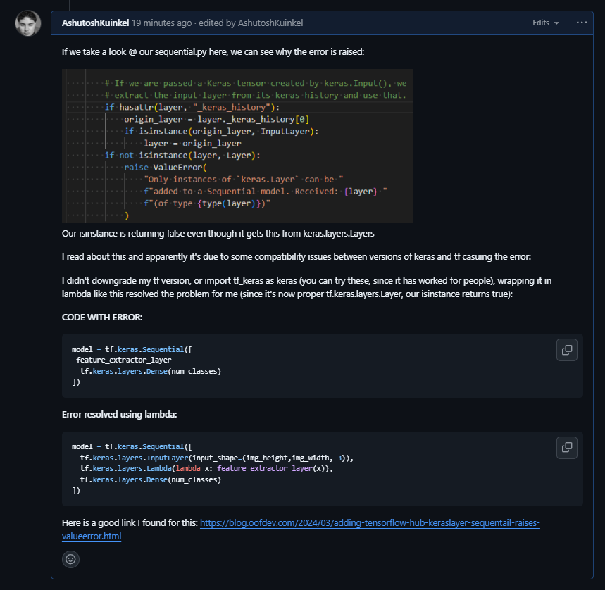
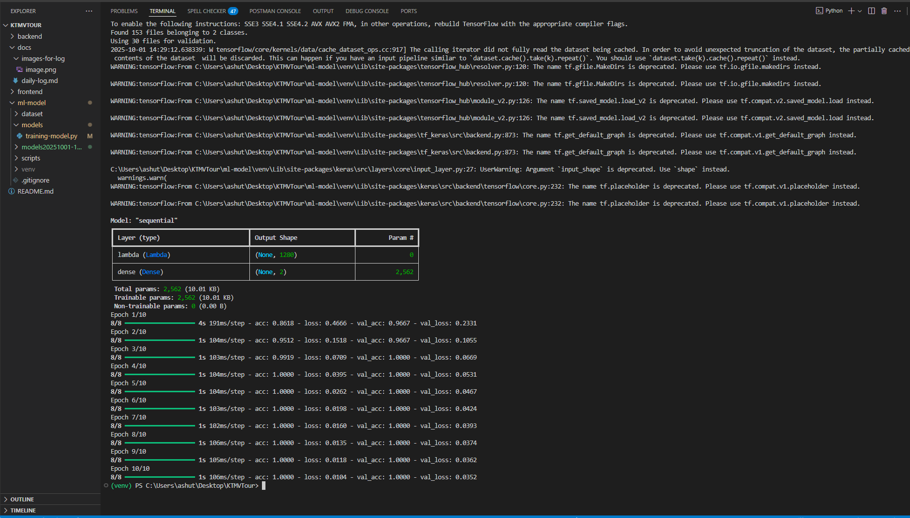
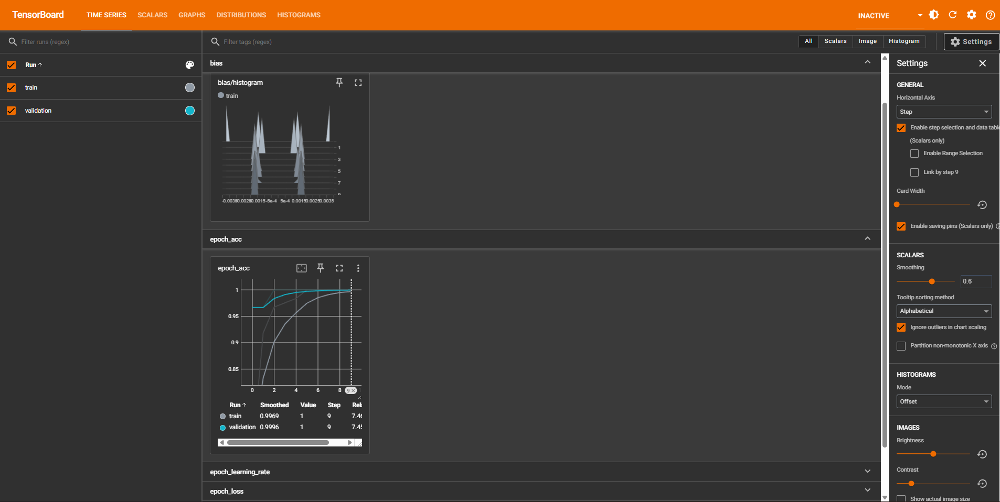
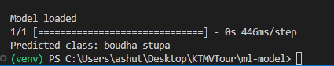

## 30 Sept 25

- Initialised folder structure.
- Added photos of the two landmarks using ICrawler.
- Watched a video on transfer learning using TensorFlow + mobilenetv2 from code basics.
- setup the transfer learning in training-model.py file using tensor flow

## 1 Oct 25

- Continued working through traning-model.py transfer learning
- currently getting typeerror problem:

```bash
  Traceback (most recent call last):
  File "c:\Users\ashut\Desktop\KTMVTour\ml-model\models\training-model.py", line 149, in <module>
  model = tf.keras.Sequential([
  ^^^^^^^^^^^^^^^^^^^^^
  File "C:\Users\ashut\Desktop\KTMVTour\ml-model\venv\Lib\site-packages\keras\src\models\sequential.py", line 75, in **init**
  self.add(layer, rebuild=False)
  File "C:\Users\ashut\Desktop\KTMVTour\ml-model\venv\Lib\site-packages\keras\src\models\sequential.py", line 97, in add
  raise ValueError(
  ValueError: Only instances of `keras.Layer` can be added to a Sequential model. Received: <tensorflow_hub.keras_layer.KerasLayer object at 0x000001E2F98C0F10> (of type <class 'tensorflow_hub.keras_layer. KerasLayer'>)
```

- I wrote about how I solved it here on github (https://github.com/tensorflow/tensorflow/issues/63849#issuecomment-3354405639):


- Btw the lambda layer wraps a function and does not declare its input shape. Previously our hub.KerasLayer declared the input shape, so TensorFlow could build model right away. 
but with lamda, we need to tell the model what kind of input shape its taking by just declaring it like this: tf.keras.layers.InputLayer(input_shape=(img_height,img_width, 3)), e.g (224,224,3)


- Completed model training:



-Exported model, now starting to test the model.

-when testing the model it turns out that since i used lambda to resolve the sequential access problem i have to import the mnodel using safe_mode=false.
- That's fine, I did that, but then boom run into another error saying:

```bash
Traceback (most recent call last):
  File "c:\Users\ashut\Desktop\KTMVTour\ml-model\models\testing-model.py", line 26, in <module>
    predictions = myModel.predict(img)
                  ^^^^^^^^^^^^^^^^^^^^
  File "C:\Users\ashut\Desktop\KTMVTour\ml-model\venv\Lib\site-packages\keras\src\utils\traceback_utils.py", line 122, in error_handler
    raise e.with_traceback(filtered_tb) from None
  File "c:/Users/ashut/Desktop/KTMVTour/ml-model/models/training-model.py", line 153, in <lambda>
    # Keras Sequential API is a way to build your neural network by lining up layers in order, like a stack of Lego blocks.
                                       ^^^^^^^^^^^^^^^^^^^^^^^
NameError: Exception encountered when calling Lambda.call().

name 'feature_extractor_layer' is not defined

Arguments received by Lambda.call():
  • inputs=tf.Tensor(shape=(1, 224, 224, 3), dtype=float32)
  • mask=None
  • training=False
```

-now im trying to remove the lambda and get it working again.
- RAHH Finally solved error using this peice:
```bash
version_fn = getattr(tf.keras, "version", None)
if version_fn and version_fn().startswith("3."):
  import tf_keras as keras
else:
  keras = tf.keras
```

- I did see this before & try it but I didn't change all my tf.keras imports to keras thats why it wasn't working. 
- I loaded up a simple test script from grok as a sample & it worked:
