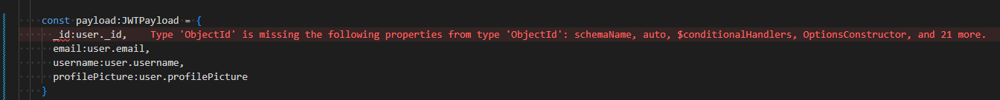
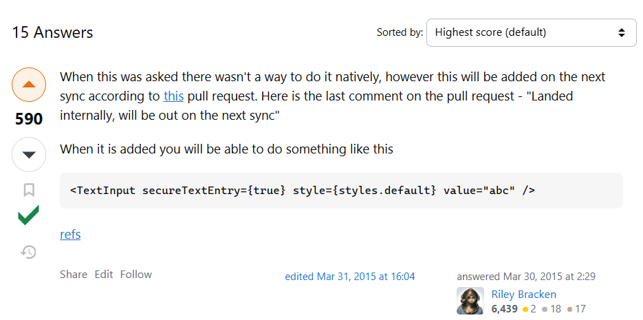
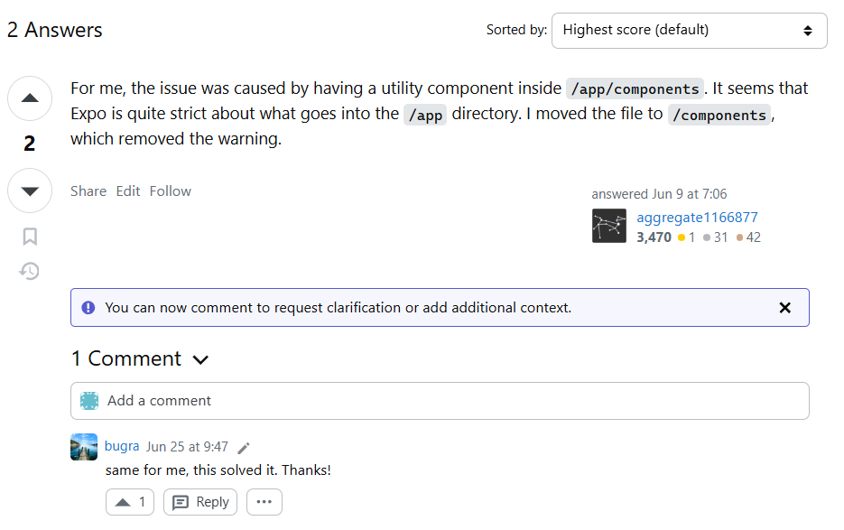
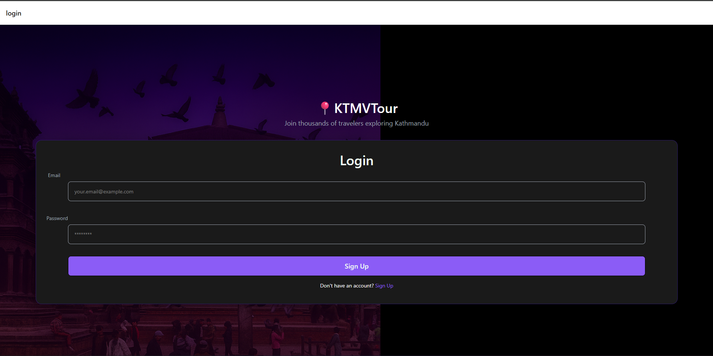
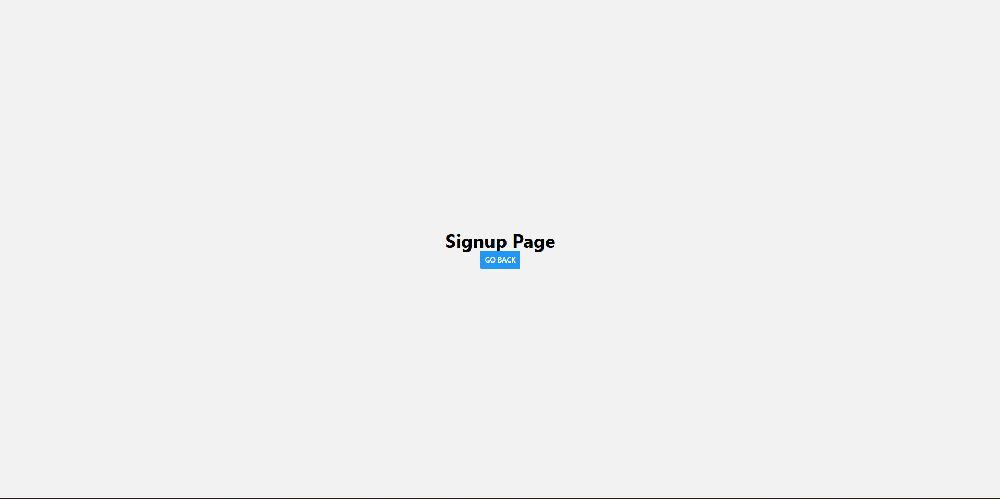

## 30 Sept 25

- Initialised folder structure.
- Added photos of the two landmarks using ICrawler.
- Watched a video on transfer learning using TensorFlow + mobilenetv2 from code basics.
- setup the transfer learning in training-model.py file using tensor flow

## 1 Oct 25

- Continued working through traning-model.py transfer learning
- currently getting typeerror problem:

```bash
  Traceback (most recent call last):
  File "c:\Users\ashut\Desktop\KTMVTour\ml-model\models\training-model.py", line 149, in <module>
  model = tf.keras.Sequential([
  ^^^^^^^^^^^^^^^^^^^^^
  File "C:\Users\ashut\Desktop\KTMVTour\ml-model\venv\Lib\site-packages\keras\src\models\sequential.py", line 75, in **init**
  self.add(layer, rebuild=False)
  File "C:\Users\ashut\Desktop\KTMVTour\ml-model\venv\Lib\site-packages\keras\src\models\sequential.py", line 97, in add
  raise ValueError(
  ValueError: Only instances of `keras.Layer` can be added to a Sequential model. Received: <tensorflow_hub.keras_layer.KerasLayer object at 0x000001E2F98C0F10> (of type <class 'tensorflow_hub.keras_layer. KerasLayer'>)
```

- I wrote about how I solved it here on github (https://github.com/tensorflow/tensorflow/issues/63849#issuecomment-3354405639):
  

- Btw the lambda layer wraps a function and does not declare its input shape. Previously our hub.KerasLayer declared the input shape, so TensorFlow could build model right away.
  but with lamda, we need to tell the model what kind of input shape its taking by just declaring it like this: tf.keras.layers.InputLayer(input_shape=(img_height,img_width, 3)), e.g (224,224,3)

- Completed model training:
  
  

-Exported model, now starting to test the model.

-when testing the model it turns out that since i used lambda to resolve the sequential access problem i have to import the mnodel using safe_mode=false.

- That's fine, I did that, but then boom run into another error saying:

```bash
Traceback (most recent call last):
  File "c:\Users\ashut\Desktop\KTMVTour\ml-model\models\testing-model.py", line 26, in <module>
    predictions = myModel.predict(img)
                  ^^^^^^^^^^^^^^^^^^^^
  File "C:\Users\ashut\Desktop\KTMVTour\ml-model\venv\Lib\site-packages\keras\src\utils\traceback_utils.py", line 122, in error_handler
    raise e.with_traceback(filtered_tb) from None
  File "c:/Users/ashut/Desktop/KTMVTour/ml-model/models/training-model.py", line 153, in <lambda>
    # Keras Sequential API is a way to build your neural network by lining up layers in order, like a stack of Lego blocks.
                                       ^^^^^^^^^^^^^^^^^^^^^^^
NameError: Exception encountered when calling Lambda.call().

name 'feature_extractor_layer' is not defined

Arguments received by Lambda.call():
  • inputs=tf.Tensor(shape=(1, 224, 224, 3), dtype=float32)
  • mask=None
  • training=False
```

-now im trying to remove the lambda and get it working again.

- RAHH Finally solved error using this peice:

```bash
version_fn = getattr(tf.keras, "version", None)
if version_fn and version_fn().startswith("3."):
  import tf_keras as keras
else:
  keras = tf.keras
```

- I did see this before & try it but I didn't change all my tf.keras imports to keras thats why it wasn't working.
- I loaded up a simple test script from grok as a sample & it worked:

  

- Ok right, damn when doing testing even if I put a pic of my face it's still guessing between the two landmarks, boudha-stupa & dharahara.
- I need to get the accuracy on this thing up. faaaaking hell yeah i gotta get like 700 images each for 2 landmarks & they have to be realistic.
- Ok im only doing this project for 2 landmarks boudha-stupa & dharahara, and i need to add a class called no-landmark & add maybe like 2k images
- of just random shit so model can differentiate between landmark and other bullshit.

## 1 Oct 25

- got to 200 images for boudha-stupa for now
- removed ICrawler scripts + photos

## 2 Oct 25

- Spent the day grabbing some more photos of landmark.

## 3 Oct 25

- for now the plan is to get some more photos. Maybe if I can get 400 photos by end of today & then use data augmentation.
- maybe start on the frontend aswell?
- creating home page layout/design using figma.
- Initialised expo project

## 4 Oct 25

- plan for today is to continue grabbing images for dataset & also get some sections of the frontend styling on app complete.
- Following along with this tutorial to get an idea of how native works + some tips: https://www.youtube.com/watch?v=f8Z9JyB2EIE

## 5 Oct 25

- continued grabbing some more images + working on site home

## 6 Oct 25

- I didn't even grab any images today, I basically got 500 for first landmark, may just use data augmentation to make total like 800.
- Spent some time doing my other assignment today + been learning dsa + git workflows + aws these past couple of days.
- regardless, the frontend styling for home page isn't even gonna take long so it's fine. I may also just start on the backend on node aswell soon.
- after i finish training my model & importing the AR part, project is just about making use of location APIs, from there it's just basic crud APIs.
- not much significant errors encountered so far on react native, guess it's basically same as react tho that's why. Just syntax confusion.

## 7 Oct 25

- Filtered out useless images from second landmark folder
- Plan for today is to grab images of second landmark & get some frontend done + setup backend folders.
- I'll also dive into what db I should use, mongo should do but lets see.

- Ok i ran into sort of a positioning issue, I was trying to use absolute positioning like this on my icon:

```TypeScript
          <MapPin
            size={24}
            color={"#8B5CF6"}
            className="absolute top-[20%] left-[10%] animate-pulse"
          />
          <MapPin
            size={24}
            color={"#8B5CF6"}
            className="absolute bottom-[10%] left-[15%] animate-pulse"
          />
          <MapPin
            size={24}
            color={"#8B5CF6"}
            className="absolute top-[10%] right-[10%] animate-pulse"
          />
```

instead needded to do it like this:

```TypeScript
          <View className="flex flex-col items-center justify-center">
            <Map size={60} color={"#8B5CF6"}/>
            <Text className="text-secondary animate-pulse">
              Interactive map loading...
            </Text>
          </View>
          <View className="absolute top-12 left-12 animate-pulse">
            <MapPin size={24} color={"#8B5CF6"} />
          </View>
          <View className="absolute bottom-12 left-8 animate-pulse">
            <MapPin size={24} color={"#8B5CF6"} />
          </View>
          <View className="absolute top-8 right-8 animate-pulse">
            <MapPin size={24} color={"#8B5CF6"} />
          </View>
```

- didn't get any images of second landmark today, and just completed half the card.
- need to speed this up. Gotta get a lot more done tomorrow. Only 1 leetcode tomorrow morning & just focus on dataset + frontend.

## 8 OCT 25

- Got Database setup on mongo, gathered only like 20 no landmark images.
- look into anomaly detection tomorrow, somehow maybe I can avoid having to fetch 2k images. Link for a video: https://www.youtube.com/watch?v=2K3ScZp1dXQ
- backend is ready to go now, initial files setup controllers ready to be made.
- spent a while on devinterview.io today skimming through 10 js & 10 ts questions. I'll aim to do 10 a day if I can..
- also got more of the frontend home page styling setup aswell

## 9 OCT 25

- Did the posts section. Had a bit of trouble with overflowing issue because of one h-screen element on parent View tag.
- No images collected.

## 10 OCT 25

- Created the share your experience card styling.
- Grabbed 100 images. Plan from today is to grab 100 images everyday & then in 20 days i'll be done grabbing 2k images for no landmark class.
- Shoudln't be hard to get 100 images of random things a day.
- Also set up a very basic register function with no password hashing.

## 11 OCT 25

- just writing some errors i encountered while doing the backend:

- forgot to use:

```TypeScript
app.use(express.json()); //used to parse incoming requests with Content-Type: application/json
app.use(express.urlencoded({ extended: true })); //used to parse application/x-www-form-urlencoded data
```

## 12 OCT 25

- got 100 images today of no landmark class
- setup login function boilerplate

## 13 OCT 25

- alright im starting off grabbing 100 images for dataset, if I don't do it first thing I'll probably not do it at all.
- also I need to see if and how we can use cookies for react native.
- god damn, Im in 2 sticky situations;
- Firstly, I can't use react native vision camera with the default expo go app, I need to use development builds or EAS build.
- Secondly, i have somewhat of an idea of what not to do for cookies, but it's still a bit rough man. I may have to send cookies from backend &
  use react-native-cookies library + axios, in frontend if that's even possible.
- ok i think adding the camera will be one of the last things I do. I'll do it when im transitioning into dev build my expo project.
- for now i'll just try to deal with the cookie problem.
- alr faak it imma build the login function and try to connect it to frontend using that cookies library. If it doesn't work, it'll be a lesson for next time.
- completed the backend of login + the 100 dataset images.

- ran across this error:
  

- I checked how we avoided this in class but it was just avoiding the type like this:

```TypeScript
const user:any = ...
```

- It gets rid of the problem, but throws away the point of typescript & type checking.
- maybe this solution i implemented here is a little better, because we still retain our types for everything else?

```TypeScript
  const payload:JWTPayload = {
    _id:user._id as any,
    email:user.email,
    username:user.username,
    profilePicture:user.profilePicture
  }
```

- but maybe it doesn't even matter in the end because our JWTPayload is already setting types to string etc.

## 14 OCT 25

- ok what I want to do for my project today is make sure I have a frontend styling of auth forms and implement different routes for them, e.g so if user clicks community
  or profile it just redirects them to the login page for now + also get the 100 images dataset.

- Ts in stack overflow saved me harrd, had to hide passowrd as it was being input and they dont got type password like react:
  

- finished the 100 images collection

- Big GOAT right here, shoutout my boy (even tho its on RHF RN docs, still helped w the understanding part):
  https://medium.com/@rutikpanchal121/building-a-robust-form-in-react-native-with-react-hook-form-and-zod-for-validation-7583678970c3

- I finished the frontend part with React hook form + yup aswell and now all that's left is just call backend using axios. I'll try doing it with no
  RN cookies library and try to find a bug/error.

- Can't be bothered doing no more, gotta play some fifa tn, gotta go over one leetcode problem & answer some basic react interview q's then continue tomorrow.

## 15 OCT 25

- starting off by grabbing 100 images for my no landmark class. (grabbed almost 3/4 from my camera roll)

- with axios im just using my basic localhost url rn, since I haven't deployed backend. Alright, now it's time to do the react query implementation.

- found a very good recent tutorial that goes over exactly what im trying to do (with react query):
  https://www.youtube.com/watch?v=H0CuK7MPtnI

- using toastify-react-native library for the onSuccess/onError messages.
- Link: https://www.npmjs.com/package/toastify-react-native

- Im running into these errors, because I think i put the .ts files in my app folder and im thinking its being included in a route defintion inside the app folder:

```bash
 WARN  Route "./api/auth.api.ts" is missing the required default export. Ensure a React component is exported as default.
 WARN  Route "./schema/auth.schema.ts" is missing the required default export. Ensure a React component is exported as default.
 WARN  Route "./types/auth.types.ts" is missing the required default export. Ensure a React component is exported as default.
```

- Yeah that should be the problem, i looked on stack overflow and have other people saying the same thing,:
  

- I created a src folder with the api, schema + types folders within it, basically anything that was not tsx file.
- Since the folders are moved elsewhere, im a little skeptical about the layout file in which I wrapped it with my queryclientprovider + toastmanager,
  but I think it should be fine.

- hmm so there are no errors logged but app still isn't working because of an error

- ahh yes, the problem is in the layout file in which I had this:

```TypeScript
import { Stack } from "expo-router";
import "./globals.css";
import { QueryClient, QueryClientProvider } from "@tanstack/react-query";
import ToastManager from "toastify-react-native";

// Create a client
const queryClient = new QueryClient();

export default function RootLayout() {
  return (
    //wrapping out app with the queryClientProvider
    <QueryClientProvider client={queryClient}>
      <ToastManager>
        <Stack>
          <Stack.Screen name="(tabs)" options={{ headerShown: false }} />
        </Stack>
      </ToastManager>
    </QueryClientProvider>
  );
}
```

- changing it to this again, makes it work but then when I try to access the temporary login page it tells me no queryclient set:

```TypeScript
import { Stack } from "expo-router";
import "./globals.css";
import { QueryClient, QueryClientProvider } from "@tanstack/react-query";

export default function RootLayout() {
  return (
    <Stack>
      <Stack.Screen name="(tabs)" options={{ headerShown: false }} />
    </Stack>
  );
}
```

- i'll try structuring the query client provider within the stack
- still not working like this aswell:

```TypeScript
    <Stack>
      <QueryClientProvider client={queryClient}>
        <ToastManager>
          <Stack.Screen name="(tabs)" options={{ headerShown: false }} />
        </ToastManager>
      </QueryClientProvider>
    </Stack>
```

- there's also another error that says:

```TypeScript
  //cant perform react state update on a component that hasn't mounted yet. This indicates that you have a side-effect in your render function that asynchronously later calls tries to update the component. Move this work to useEffect instead.
```

- ok i found the problem for the first error, it wasn't with queryclient provider it was with the toast manager instead, because my project is working well like this:

```TypeScript
import { Stack } from "expo-router";
import "./globals.css";
import { QueryClient, QueryClientProvider } from "@tanstack/react-query";

// Create a client
const queryClient = new QueryClient();

export default function RootLayout() {
  return (
    //wrapping out app with the queryClientProvider
    <QueryClientProvider client={queryClient}>
      <Stack>
        <Stack.Screen name="(tabs)" options={{ headerShown: false }} />
      </Stack>
    </QueryClientProvider>
  );
}
```

- Okay I set the toastmanager tag in my login form where toast is being used and that solved my problem.

- Now the login form is working, but when im entering correct details it says login failed still.

- ahh, the error message is saying cannot read property data of undefined. I think the inputs aren't being sent properly to the backend function.

- using our clg statement, i can clearly see that the correct data is being submitted. it logs the email + password being submitted.:

```TypeScript
  const onSubmit = async(data:ILoginData) => {
    console.log('Submit data:', data);
    mutate(data)
  };
```

- It's mad weird because it's working on postman but not my expo app. Maybe not having the deployed backend is a problem?

- okay look:

```TypeScript
    if (err?.response) {
      throw err.response.data;
    } else {
      throw new Error('Network or Server Error');
    }
```

- I'm hitting toast message that says network or server error. I 100% think it's a problem with the url not being read properly
  by react native since im using local host, so it doesn't recognise my backend. I will deploy my backend on render + style the toast messages and then it should work.

- deployed my site on render and connected it to frontend by creating axios instance, but ran into this error:

```bash
iOS Bundling failed 1612ms node_modules\expo-router\entry.js (3242 modules)
The package at "node_modules\dotenv\lib\main.js" attempted to import the Node standard library module "path".
It failed because the native React runtime does not include the Node standard library.
Learn more: https://docs.expo.dev/workflow/using-libraries/#using-third-party-libraries
  1 | const fs = require('fs')
> 2 | const path = require('path')
    |                       ^
  3 | const os = require('os')
  4 | const crypto = require('crypto')
  5 | const packageJson = require('../package.json')

Import stack:

 node_modules\dotenv\lib\main.js
 | import "path"

 src\api\index.ts
 | import "dotenv"

 src\api\auth.api.ts
 | import "./index"

 app\components\auth\login.form.tsx
 | import "@/src/api/auth.api"

 app\(tabs)\profile.tsx
 | import "../components/auth/login.form"

 app (require.context)
```

- apparently you don't need dotenv or anyting, in expo projects u can just make sure your variables start with EXPO*PUBLIC* & use process.env in ur files , the expo docs said this:

```TypeScript
//The Expo CLI will automatically load environment variables with an EXPO_PUBLIC_ prefix from .env files for use within your JavaScript code whenever you use the Expo CLI, such as when running npx expo start to start your app in local development mode.
```

- hmmm it's connected to render now but it's still not logging me in

- ahhh I see the problem now, i forgot to add accessible for any ip in mongodb account:
  

- ok that problem is fixed, I can login now finally, but I think process.env.EXPO_PUBLIC_API_BASE_URL isn't returning correct url because when i do axios.post('myurl') it works but not when I do api.post('/auth/login').

- I just added it in extra inside of app.json and then imported the expo constants in the instance file like this:

```TypeScript
// using this file to create an instance
import axios from "axios";
import Constants from 'expo-constants';

const apiBaseUrl = Constants.expoConfig?.extra?.apiBaseUrl
const instance = axios.create({
  baseURL: apiBaseUrl,
  withCredentials:true
})

export default instance
```

- Im reading more about how I should store data and MMKV seems like a good storage since, it's similar to asyncStorage but allows you to encrypt your data aswell.
  So it's good for storing more sensitive data aswell. But anyways, that should be good enough for today. I'll continue tomorrow. Tomorrow if I can get the user stored
  using MMKV and make sure to add protected route to the whole app. Essientially, the user must create an account to use the app. Originally I was thinking maybe we let user
  see home page + tour landmarks without logging in but nah, it's just much more efficient if user is logged in before even accessing anything. Ok, i also got an idea, once we
  give the user a virtual tour of a landmark it should feature an end screen that prompts them to share their experience (in other words post a picture of them @ the landmark)

## 16 OCT 25

- Ok mmkv is a drag you have to setup dev build, eas, expo dev account etc. I'm watching this tutorial with JWT auth: https://www.youtube.com/watch?v=uP9SGbglMe4

- Ok i made sure the entire app is protected using expo router within layout file, it's just a simple test script for now:

```TypeScript
import { Stack } from "expo-router";
import "./globals.css";
import { QueryClient, QueryClientProvider } from "@tanstack/react-query";

// Create a client
const queryClient = new QueryClient();
const isAuthenticated = false

export default function RootLayout() {
  return (
    //wrapping out app with the queryClientProvider
    <QueryClientProvider client={queryClient}>
      <Stack>
        <Stack.Protected guard={isAuthenticated}>
          <Stack.Screen name="(tabs)" options={{ headerShown: false }} />
        </Stack.Protected>
      </Stack>
    </QueryClientProvider>
  );
}
```

- This makes it so that you must be logged in to access the app.

- It's working well but it's showing like a white navbar with the page name, i need to get rid of that:
  

- This was as simple as setting showHeader false:

```TypeScript
  <Stack.Protected guard={!isAuthenticated}>
    <Stack.Screen name="login" options={{headerShown: false}}/>
    <Stack.Screen name="signup" options={{headerShown: false}}/>
  </Stack.Protected>
```
- Initialised a signup page, need to style it later and make it work:


- following that JWT tutorial & installing zustant + mmkv. I tried to do npx expo prebuild & this is the error it gave me:
```bash
PS C:\Users\ashut\Desktop\KTMVTour\frontend\KTMVTour> npx expo prebuild
› Android package name: com.anonymous.KTMVTour
√ Created native directory
√ Updated package.json
× Prebuild failed
Error: [android.dangerous]: withAndroidDangerousBaseMod: ENOENT: no such file or directory, open 'C:\Users\ashut\Desktop\KTMVTour\frontend\KTMVTour\assets\images\splash-icon.png'
Error: [android.dangerous]: withAndroidDangerousBaseMod: ENOENT: no such file or directory, open 'C:\Users\ashut\Desktop\KTMVTour\frontend\KTMVTour\assets\images\splash-icon.png'
    at Object.openSync (node:fs:562:18)
    at Object.readFileSync (node:fs:446:35)
    at calculateHash (C:\Users\ashut\Desktop\KTMVTour\frontend\KTMVTour\node_modules\@expo\image-utils\build\Cache.js:19:76)
    at createCacheKey (C:\Users\ashut\Desktop\KTMVTour\frontend\KTMVTour\node_modules\@expo\image-utils\build\Cache.js:24:18)
    at Object.createCacheKeyWithDirectoryAsync (C:\Users\ashut\Desktop\KTMVTour\frontend\KTMVTour\node_modules\@expo\image-utils\build\Cache.js:32:33)
    at generateImageAsync (C:\Users\ashut\Desktop\KTMVTour\frontend\KTMVTour\node_modules\@expo\image-utils\build\Image.js:227:34)
    at process.processTicksAndRejections (node:internal/process/task_queues:105:5)
    at async C:\Users\ashut\Desktop\KTMVTour\frontend\KTMVTour\node_modules\@expo\prebuild-config\build\plugins\unversioned\expo-splash-screen\withAndroidSplashImages.js:177:11
    at async Promise.all (index 0)
    at async setSplashImageDrawablesForThemeAsync (C:\Users\ashut\Desktop\KTMVTour\frontend\KTMVTour\node_modules\@expo\prebuild-config\build\plugins\unversioned\expo-splash-screen\withAndroidSplashImages.js:162:3)
PS C:\Users\ashut\Desktop\KTMVTour\frontend\KTMVTour> 
```

- Ok so I knew it was saying it couldn't find a file named splash-icon.png. I searched up what is splash icon and it turns out it's what the user sees when the app is intially loading.
- I'll go on figma and quickly create this. BTW, it's only creating an andriod folder so far when I run npx expo prebuild so idk what's up with that.

- splash screen done, I will now go and use EAS build, very good tutorial walking through the process of actually getting the app running 
 from expo youtube channel: https://www.youtube.com/watch?v=FdjczjkwQKE

- man wtf is this, to even create an apple dev account u need to pay $150 a year. Im gonna have to run an andriod emulator on pc and install it there because it's free on andriod
 apparently.

- finally got the dev build working on andriod. I can run my own app now. Task for tomorrow now is to make sure I get the auth all setup.

- Ahh, im working tomorrow so yeah, I won't be able to get much done. Hopefully just zustand + mmkv setup and then saturday I should be
 able to finish profile page completely, or at least get a lot done.


## 17 OCT 25

- Ok when setting up the auth store I ran into a problem for a while because of some silly mistake(the is authenticated was outside function root layout):
```TypeScript
import { Stack } from "expo-router";
import "./globals.css";
import { QueryClient, QueryClientProvider } from "@tanstack/react-query";
import { useAuthStore } from "@/src/store/auth.store";

// Create a client
const queryClient = new QueryClient();
// Successfully created authstore using zustand
const {isAuthenticated} = useAuthStore()

export default function RootLayout() {
  return (
    //wrapping out app with the queryClientProvider
    <QueryClientProvider client={queryClient}>
      <Stack >
        <Stack.Protected guard={isAuthenticated}>
          <Stack.Screen name="(tabs)" options={{ headerShown: false }} />
        </Stack.Protected>
        <Stack.Protected guard={!isAuthenticated}>
          <Stack.Screen name="login" options={{headerShown: false}}/>
          <Stack.Screen name="signup" options={{headerShown: false}}/>
        </Stack.Protected>
      </Stack>
    </QueryClientProvider>
  );
}
```

I changed it to this and it worked (also when calling handleLogin function in onSuccess, it should be handlelogin() not handlelogin):
```TypeScript
import { Stack } from "expo-router";
import "./globals.css";
import { QueryClient, QueryClientProvider } from "@tanstack/react-query";
import { useAuthStore } from "@/src/store/auth.store";

// Create a client
const queryClient = new QueryClient();

export default function RootLayout() {
  // Successfully created authstore using zustand
  const { isAuthenticated } = useAuthStore();
  
  return (
    //wrapping out app with the queryClientProvider
    <QueryClientProvider client={queryClient}>
      <Stack>
        <Stack.Protected guard={isAuthenticated}>
          <Stack.Screen name="(tabs)" options={{ headerShown: false }} />
        </Stack.Protected>
        <Stack.Protected guard={!isAuthenticated}>
          <Stack.Screen name="login" options={{ headerShown: false }} />
          <Stack.Screen name="signup" options={{ headerShown: false }} />
        </Stack.Protected>
      </Stack>
    </QueryClientProvider>
  );
}
```