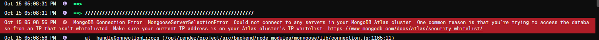

## 30 Sept 25

- Initialised folder structure.
- Added photos of the two landmarks using ICrawler.
- Watched a video on transfer learning using TensorFlow + mobilenetv2 from code basics.
- setup the transfer learning in training-model.py file using tensor flow

## 1 Oct 25

- Continued working through traning-model.py transfer learning
- currently getting typeerror problem:

```bash
  Traceback (most recent call last):
  File "c:\Users\ashut\Desktop\KTMVTour\ml-model\models\training-model.py", line 149, in <module>
  model = tf.keras.Sequential([
  ^^^^^^^^^^^^^^^^^^^^^
  File "C:\Users\ashut\Desktop\KTMVTour\ml-model\venv\Lib\site-packages\keras\src\models\sequential.py", line 75, in **init**
  self.add(layer, rebuild=False)
  File "C:\Users\ashut\Desktop\KTMVTour\ml-model\venv\Lib\site-packages\keras\src\models\sequential.py", line 97, in add
  raise ValueError(
  ValueError: Only instances of `keras.Layer` can be added to a Sequential model. Received: <tensorflow_hub.keras_layer.KerasLayer object at 0x000001E2F98C0F10> (of type <class 'tensorflow_hub.keras_layer. KerasLayer'>)
```

- I wrote about how I solved it here on github (https://github.com/tensorflow/tensorflow/issues/63849#issuecomment-3354405639):
  

- Btw the lambda layer wraps a function and does not declare its input shape. Previously our hub.KerasLayer declared the input shape, so TensorFlow could build model right away.
  but with lamda, we need to tell the model what kind of input shape its taking by just declaring it like this: tf.keras.layers.InputLayer(input_shape=(img_height,img_width, 3)), e.g (224,224,3)

- Completed model training:
  
  

-Exported model, now starting to test the model.

-when testing the model it turns out that since i used lambda to resolve the sequential access problem i have to import the mnodel using safe_mode=false.

- That's fine, I did that, but then boom run into another error saying:

```bash
Traceback (most recent call last):
  File "c:\Users\ashut\Desktop\KTMVTour\ml-model\models\testing-model.py", line 26, in <module>
    predictions = myModel.predict(img)
                  ^^^^^^^^^^^^^^^^^^^^
  File "C:\Users\ashut\Desktop\KTMVTour\ml-model\venv\Lib\site-packages\keras\src\utils\traceback_utils.py", line 122, in error_handler
    raise e.with_traceback(filtered_tb) from None
  File "c:/Users/ashut/Desktop/KTMVTour/ml-model/models/training-model.py", line 153, in <lambda>
    # Keras Sequential API is a way to build your neural network by lining up layers in order, like a stack of Lego blocks.
                                       ^^^^^^^^^^^^^^^^^^^^^^^
NameError: Exception encountered when calling Lambda.call().

name 'feature_extractor_layer' is not defined

Arguments received by Lambda.call():
  • inputs=tf.Tensor(shape=(1, 224, 224, 3), dtype=float32)
  • mask=None
  • training=False
```

-now im trying to remove the lambda and get it working again.

- RAHH Finally solved error using this peice:

```bash
version_fn = getattr(tf.keras, "version", None)
if version_fn and version_fn().startswith("3."):
  import tf_keras as keras
else:
  keras = tf.keras
```

- I did see this before & try it but I didn't change all my tf.keras imports to keras thats why it wasn't working.
- I loaded up a simple test script from grok as a sample & it worked:

  

- Ok right, damn when doing testing even if I put a pic of my face it's still guessing between the two landmarks.
- I need to get the accuracy on this thing up. faaaaking hell yeah i gotta get like 700 images each for 2 landmarks & they have to be realistic.
- Ok im only doing this project for 2 landmarks, and i need to add a class called no-landmark & add maybe like 2k images
- of just random shit so model can differentiate between landmark and other bullshit.

## 1 Oct 25

- got to 200 images for landmark a for now
- removed ICrawler scripts + photos

## 2 Oct 25

- Spent the day grabbing some more photos of landmark.

## 3 Oct 25

- for now the plan is to get some more photos. Maybe if I can get 400 photos by end of today & then use data augmentation.
- maybe start on the frontend aswell?
- creating home page layout/design using figma.
- Initialised expo project

## 4 Oct 25

- plan for today is to continue grabbing images for dataset & also get some sections of the frontend styling on app complete.
- Following along with this tutorial to get an idea of how native works + some tips: https://www.youtube.com/watch?v=f8Z9JyB2EIE

## 5 Oct 25

- continued grabbing some more images + working on site home

## 6 Oct 25

- I didn't even grab any images today, I basically got 500 for first landmark, may just use data augmentation to make total like 800.
- Spent some time doing my other assignment today + been learning dsa + git workflows + aws these past couple of days.
- regardless, the frontend styling for home page isn't even gonna take long so it's fine. I may also just start on the backend on node aswell soon.
- after i finish training my model & importing the AR part, project is just about making use of location APIs, from there it's just basic crud APIs.
- not much significant errors encountered so far on react native, guess it's basically same as react tho that's why. Just syntax confusion.

## 7 Oct 25

- Filtered out useless images from second landmark folder
- Plan for today is to grab images of second landmark & get some frontend done + setup backend folders.
- I'll also dive into what db I should use, mongo should do but lets see.

- Ok i ran into sort of a positioning issue, I was trying to use absolute positioning like this on my icon:

```TypeScript
          <MapPin
            size={24}
            color={"#8B5CF6"}
            className="absolute top-[20%] left-[10%] animate-pulse"
          />
          <MapPin
            size={24}
            color={"#8B5CF6"}
            className="absolute bottom-[10%] left-[15%] animate-pulse"
          />
          <MapPin
            size={24}
            color={"#8B5CF6"}
            className="absolute top-[10%] right-[10%] animate-pulse"
          />
```

instead needded to do it like this:

```TypeScript
          <View className="flex flex-col items-center justify-center">
            <Map size={60} color={"#8B5CF6"}/>
            <Text className="text-secondary animate-pulse">
              Interactive map loading...
            </Text>
          </View>
          <View className="absolute top-12 left-12 animate-pulse">
            <MapPin size={24} color={"#8B5CF6"} />
          </View>
          <View className="absolute bottom-12 left-8 animate-pulse">
            <MapPin size={24} color={"#8B5CF6"} />
          </View>
          <View className="absolute top-8 right-8 animate-pulse">
            <MapPin size={24} color={"#8B5CF6"} />
          </View>
```

- didn't get any images of second landmark today, and just completed half the card.
- need to speed this up. Gotta get a lot more done tomorrow. Only 1 leetcode tomorrow morning & just focus on dataset + frontend.

## 8 OCT 25

- Got Database setup on mongo, gathered only like 20 no landmark images.
- look into anomaly detection tomorrow, somehow maybe I can avoid having to fetch 2k images. Link for a video: https://www.youtube.com/watch?v=2K3ScZp1dXQ
- backend is ready to go now, initial files setup controllers ready to be made.
- spent a while on devinterview.io today skimming through 10 js & 10 ts questions. I'll aim to do 10 a day if I can..
- also got more of the frontend home page styling setup aswell

## 9 OCT 25

- Did the posts section. Had a bit of trouble with overflowing issue because of one h-screen element on parent View tag.
- No images collected.

## 10 OCT 25

- Created the share your experience card styling.
- Grabbed 100 images. Plan from today is to grab 100 images everyday & then in 20 days i'll be done grabbing 2k images for no landmark class.
- Shoudln't be hard to get 100 images of random things a day.
- Also set up a very basic register function with no password hashing.

## 11 OCT 25

- just writing some errors i encountered while doing the backend:

- forgot to use:

```TypeScript
app.use(express.json()); //used to parse incoming requests with Content-Type: application/json
app.use(express.urlencoded({ extended: true })); //used to parse application/x-www-form-urlencoded data
```

## 12 OCT 25

- got 100 images today of no landmark class
- setup login function boilerplate

## 13 OCT 25

- alright im starting off grabbing 100 images for dataset, if I don't do it first thing I'll probably not do it at all.
- also I need to see if and how we can use cookies for react native.
- god damn, Im in 2 sticky situations;
- Firstly, I can't use react native vision camera with the default expo go app, I need to use development builds or EAS build.
- Secondly, i have somewhat of an idea of what not to do for cookies, but it's still a bit rough man. I may have to send cookies from backend &
  use react-native-cookies library + axios, in frontend if that's even possible.
- ok i think adding the camera will be one of the last things I do. I'll do it when im transitioning into dev build my expo project.
- for now i'll just try to deal with the cookie problem.
- alr faak it imma build the login function and try to connect it to frontend using that cookies library. If it doesn't work, it'll be a lesson for next time.
- completed the backend of login + the 100 dataset images.

- ran across this error:
  

- I checked how we avoided this in class but it was just avoiding the type like this:

```TypeScript
const user:any = ...
```

- It gets rid of the problem, but throws away the point of typescript & type checking.
- maybe this solution i implemented here is a little better, because we still retain our types for everything else?

```TypeScript
  const payload:JWTPayload = {
    _id:user._id as any,
    email:user.email,
    username:user.username,
    profilePicture:user.profilePicture
  }
```

- but maybe it doesn't even matter in the end because our JWTPayload is already setting types to string etc.

## 14 OCT 25

- ok what I want to do for my project today is make sure I have a frontend styling of auth forms and implement different routes for them, e.g so if user clicks community
  or profile it just redirects them to the login page for now + also get the 100 images dataset.

- Ts in stack overflow saved me harrd, had to hide passowrd as it was being input and they dont got type password like react:
  

- finished the 100 images collection

- Big GOAT right here, shoutout my boy (even tho its on RHF RN docs, still helped w the understanding part):
  https://medium.com/@rutikpanchal121/building-a-robust-form-in-react-native-with-react-hook-form-and-zod-for-validation-7583678970c3

- I finished the frontend part with React hook form + yup aswell and now all that's left is just call backend using axios. I'll try doing it with no
  RN cookies library and try to find a bug/error.

- Can't be bothered doing no more, gotta play some fifa tn, gotta go over one leetcode problem & answer some basic react interview q's then continue tomorrow.

## 15 OCT 25

- starting off by grabbing 100 images for my no landmark class. (grabbed almost 3/4 from my camera roll)

- with axios im just using my basic localhost url rn, since I haven't deployed backend. Alright, now it's time to do the react query implementation.

- found a very good recent tutorial that goes over exactly what im trying to do (with react query):
  https://www.youtube.com/watch?v=H0CuK7MPtnI

- using toastify-react-native library for the onSuccess/onError messages.
- Link: https://www.npmjs.com/package/toastify-react-native

- Im running into these errors, because I think i put the .ts files in my app folder and im thinking its being included in a route defintion inside the app folder:

```bash
 WARN  Route "./api/auth.api.ts" is missing the required default export. Ensure a React component is exported as default.
 WARN  Route "./schema/auth.schema.ts" is missing the required default export. Ensure a React component is exported as default.
 WARN  Route "./types/auth.types.ts" is missing the required default export. Ensure a React component is exported as default.
```

- Yeah that should be the problem, i looked on stack overflow and have other people saying the same thing,:
  

- I created a src folder with the api, schema + types folders within it, basically anything that was not tsx file.
- Since the folders are moved elsewhere, im a little skeptical about the layout file in which I wrapped it with my queryclientprovider + toastmanager,
  but I think it should be fine.

- hmm so there are no errors logged but app still isn't working because of an error

- ahh yes, the problem is in the layout file in which I had this:

```TypeScript
import { Stack } from "expo-router";
import "./globals.css";
import { QueryClient, QueryClientProvider } from "@tanstack/react-query";
import ToastManager from "toastify-react-native";

// Create a client
const queryClient = new QueryClient();

export default function RootLayout() {
  return (
    //wrapping out app with the queryClientProvider
    <QueryClientProvider client={queryClient}>
      <ToastManager>
        <Stack>
          <Stack.Screen name="(tabs)" options={{ headerShown: false }} />
        </Stack>
      </ToastManager>
    </QueryClientProvider>
  );
}
```

- changing it to this again, makes it work but then when I try to access the temporary login page it tells me no queryclient set:

```TypeScript
import { Stack } from "expo-router";
import "./globals.css";
import { QueryClient, QueryClientProvider } from "@tanstack/react-query";

export default function RootLayout() {
  return (
    <Stack>
      <Stack.Screen name="(tabs)" options={{ headerShown: false }} />
    </Stack>
  );
}
```

- i'll try structuring the query client provider within the stack
- still not working like this aswell:

```TypeScript
    <Stack>
      <QueryClientProvider client={queryClient}>
        <ToastManager>
          <Stack.Screen name="(tabs)" options={{ headerShown: false }} />
        </ToastManager>
      </QueryClientProvider>
    </Stack>
```

- there's also another error that says:

```TypeScript
  //cant perform react state update on a component that hasn't mounted yet. This indicates that you have a side-effect in your render function that asynchronously later calls tries to update the component. Move this work to useEffect instead.
```

- ok i found the problem for the first error, it wasn't with queryclient provider it was with the toast manager instead, because my project is working well like this:

```TypeScript
import { Stack } from "expo-router";
import "./globals.css";
import { QueryClient, QueryClientProvider } from "@tanstack/react-query";

// Create a client
const queryClient = new QueryClient();

export default function RootLayout() {
  return (
    //wrapping out app with the queryClientProvider
    <QueryClientProvider client={queryClient}>
      <Stack>
        <Stack.Screen name="(tabs)" options={{ headerShown: false }} />
      </Stack>
    </QueryClientProvider>
  );
}
```

- Okay I set the toastmanager tag in my login form where toast is being used and that solved my problem.

- Now the login form is working, but when im entering correct details it says login failed still.

- ahh, the error message is saying cannot read property data of undefined. I think the inputs aren't being sent properly to the backend function.

- using our clg statement, i can clearly see that the correct data is being submitted. it logs the email + password being submitted.:

```TypeScript
  const onSubmit = async(data:ILoginData) => {
    console.log('Submit data:', data);
    mutate(data)
  };
```

- It's mad weird because it's working on postman but not my expo app. Maybe not having the deployed backend is a problem?

- okay look:

```TypeScript
    if (err?.response) {
      throw err.response.data;
    } else {
      throw new Error('Network or Server Error');
    }
```

- I'm hitting toast message that says network or server error. I 100% think it's a problem with the url not being read properly
  by react native since im using local host, so it doesn't recognise my backend. I will deploy my backend on render + style the toast messages and then it should work.

- deployed my site on render and connected it to frontend by creating axios instance, but ran into this error:

```bash
iOS Bundling failed 1612ms node_modules\expo-router\entry.js (3242 modules)
The package at "node_modules\dotenv\lib\main.js" attempted to import the Node standard library module "path".
It failed because the native React runtime does not include the Node standard library.
Learn more: https://docs.expo.dev/workflow/using-libraries/#using-third-party-libraries
  1 | const fs = require('fs')
> 2 | const path = require('path')
    |                       ^
  3 | const os = require('os')
  4 | const crypto = require('crypto')
  5 | const packageJson = require('../package.json')

Import stack:

 node_modules\dotenv\lib\main.js
 | import "path"

 src\api\index.ts
 | import "dotenv"

 src\api\auth.api.ts
 | import "./index"

 app\components\auth\login.form.tsx
 | import "@/src/api/auth.api"

 app\(tabs)\profile.tsx
 | import "../components/auth/login.form"

 app (require.context)
```

- apparently you don't need dotenv or anyting, in expo projects u can just make sure your variables start with EXPO*PUBLIC* & use process.env in ur files , the expo docs said this:

```TypeScript
//The Expo CLI will automatically load environment variables with an EXPO_PUBLIC_ prefix from .env files for use within your JavaScript code whenever you use the Expo CLI, such as when running npx expo start to start your app in local development mode.
```

- hmmm it's connected to render now but it's still not logging me in

- ahhh I see the problem now, i forgot to add accessible for any ip in mongodb account:
  

- ok that problem is fixed, I can login now finally, but I think process.env.EXPO_PUBLIC_API_BASE_URL isn't returning correct url because when i do axios.post('myurl') it works but not when I do api.post('/auth/login').

- I just added it in extra inside of app.json and then imported the expo constants in the instance file like this:

```TypeScript
// using this file to create an instance
import axios from "axios";
import Constants from 'expo-constants';

const apiBaseUrl = Constants.expoConfig?.extra?.apiBaseUrl
const instance = axios.create({
  baseURL: apiBaseUrl,
  withCredentials:true
})

export default instance
```

- Im reading more about how I should store data and MMKV seems like a good storage since, it's similar to asyncStorage but allows you to encrypt your data aswell.
  So it's good for storing more sensitive data aswell. But anyways, that should be good enough for today. I'll continue tomorrow. Tomorrow if I can get the user stored
  using MMKV and make sure to add protected route to the whole app. Essientially, the user must create an account to use the app. Originally I was thinking maybe we let user
  see home page + tour landmarks without logging in but nah, it's just much more efficient if user is logged in before even accessing anything. Ok, i also got an idea, once we
  give the user a virtual tour of a landmark it should feature an end screen that prompts them to share their experience (in other words post a picture of them @ the landmark)

## 16 OCT 25

- Ok mmkv is a drag you have to setup dev build, eas, expo dev account etc. I'm watching this tutorial with JWT auth: https://www.youtube.com/watch?v=uP9SGbglMe4

- Ok i made sure the entire app is protected using expo router within layout file, it's just a simple test script for now:

```TypeScript
import { Stack } from "expo-router";
import "./globals.css";
import { QueryClient, QueryClientProvider } from "@tanstack/react-query";

// Create a client
const queryClient = new QueryClient();
const isAuthenticated = false

export default function RootLayout() {
  return (
    //wrapping out app with the queryClientProvider
    <QueryClientProvider client={queryClient}>
      <Stack>
        <Stack.Protected guard={isAuthenticated}>
          <Stack.Screen name="(tabs)" options={{ headerShown: false }} />
        </Stack.Protected>
      </Stack>
    </QueryClientProvider>
  );
}
```

- This makes it so that you must be logged in to access the app.

- It's working well but it's showing like a white navbar with the page name, i need to get rid of that:
  

- This was as simple as setting showHeader false:

```TypeScript
  <Stack.Protected guard={!isAuthenticated}>
    <Stack.Screen name="login" options={{headerShown: false}}/>
    <Stack.Screen name="signup" options={{headerShown: false}}/>
  </Stack.Protected>
```

- Initialised a signup page, need to style it later and make it work:
  

- following that JWT tutorial & installing zustant + mmkv. I tried to do npx expo prebuild & this is the error it gave me:

```bash
PS C:\Users\ashut\Desktop\KTMVTour\frontend\KTMVTour> npx expo prebuild
› Android package name: com.anonymous.KTMVTour
√ Created native directory
√ Updated package.json
× Prebuild failed
Error: [android.dangerous]: withAndroidDangerousBaseMod: ENOENT: no such file or directory, open 'C:\Users\ashut\Desktop\KTMVTour\frontend\KTMVTour\assets\images\splash-icon.png'
Error: [android.dangerous]: withAndroidDangerousBaseMod: ENOENT: no such file or directory, open 'C:\Users\ashut\Desktop\KTMVTour\frontend\KTMVTour\assets\images\splash-icon.png'
    at Object.openSync (node:fs:562:18)
    at Object.readFileSync (node:fs:446:35)
    at calculateHash (C:\Users\ashut\Desktop\KTMVTour\frontend\KTMVTour\node_modules\@expo\image-utils\build\Cache.js:19:76)
    at createCacheKey (C:\Users\ashut\Desktop\KTMVTour\frontend\KTMVTour\node_modules\@expo\image-utils\build\Cache.js:24:18)
    at Object.createCacheKeyWithDirectoryAsync (C:\Users\ashut\Desktop\KTMVTour\frontend\KTMVTour\node_modules\@expo\image-utils\build\Cache.js:32:33)
    at generateImageAsync (C:\Users\ashut\Desktop\KTMVTour\frontend\KTMVTour\node_modules\@expo\image-utils\build\Image.js:227:34)
    at process.processTicksAndRejections (node:internal/process/task_queues:105:5)
    at async C:\Users\ashut\Desktop\KTMVTour\frontend\KTMVTour\node_modules\@expo\prebuild-config\build\plugins\unversioned\expo-splash-screen\withAndroidSplashImages.js:177:11
    at async Promise.all (index 0)
    at async setSplashImageDrawablesForThemeAsync (C:\Users\ashut\Desktop\KTMVTour\frontend\KTMVTour\node_modules\@expo\prebuild-config\build\plugins\unversioned\expo-splash-screen\withAndroidSplashImages.js:162:3)
PS C:\Users\ashut\Desktop\KTMVTour\frontend\KTMVTour>
```

- Ok so I knew it was saying it couldn't find a file named splash-icon.png. I searched up what is splash icon and it turns out it's what the user sees when the app is intially loading.
- I'll go on figma and quickly create this. BTW, it's only creating an andriod folder so far when I run npx expo prebuild so idk what's up with that.

- splash screen done, I will now go and use EAS build, very good tutorial walking through the process of actually getting the app running
  from expo youtube channel: https://www.youtube.com/watch?v=FdjczjkwQKE

- man wtf is this, to even create an apple dev account u need to pay $150 a year. Im gonna have to run an andriod emulator on pc and install it there because it's free on andriod
  apparently.

- finally got the dev build working on andriod. I can run my own app now. Task for tomorrow now is to make sure I get the auth all setup.

- Ahh, im working tomorrow so yeah, I won't be able to get much done. Hopefully just zustand + mmkv setup and then saturday I should be
  able to finish profile page completely, or at least get a lot done.

## 17 OCT 25

- Ok when setting up the auth store I ran into a problem for a while because of some silly mistake(the is authenticated was outside function root layout):

```TypeScript
import { Stack } from "expo-router";
import "./globals.css";
import { QueryClient, QueryClientProvider } from "@tanstack/react-query";
import { useAuthStore } from "@/src/store/auth.store";

// Create a client
const queryClient = new QueryClient();
// Successfully created authstore using zustand
const {isAuthenticated} = useAuthStore()

export default function RootLayout() {
  return (
    //wrapping out app with the queryClientProvider
    <QueryClientProvider client={queryClient}>
      <Stack >
        <Stack.Protected guard={isAuthenticated}>
          <Stack.Screen name="(tabs)" options={{ headerShown: false }} />
        </Stack.Protected>
        <Stack.Protected guard={!isAuthenticated}>
          <Stack.Screen name="login" options={{headerShown: false}}/>
          <Stack.Screen name="signup" options={{headerShown: false}}/>
        </Stack.Protected>
      </Stack>
    </QueryClientProvider>
  );
}
```

I changed it to this and it worked (also when calling handleLogin function in onSuccess, it should be handlelogin() not handlelogin):

```TypeScript
import { Stack } from "expo-router";
import "./globals.css";
import { QueryClient, QueryClientProvider } from "@tanstack/react-query";
import { useAuthStore } from "@/src/store/auth.store";

// Create a client
const queryClient = new QueryClient();

export default function RootLayout() {
  // Successfully created authstore using zustand
  const { isAuthenticated } = useAuthStore();

  return (
    //wrapping out app with the queryClientProvider
    <QueryClientProvider client={queryClient}>
      <Stack>
        <Stack.Protected guard={isAuthenticated}>
          <Stack.Screen name="(tabs)" options={{ headerShown: false }} />
        </Stack.Protected>
        <Stack.Protected guard={!isAuthenticated}>
          <Stack.Screen name="login" options={{ headerShown: false }} />
          <Stack.Screen name="signup" options={{ headerShown: false }} />
        </Stack.Protected>
      </Stack>
    </QueryClientProvider>
  );
}
```

- ok I think i figured it out, storing mmkv is the exact same with how I did it in my localstorage in previous web project.
  So to store the user + access token in mmkv within the onSuccess in mutation fn I just set it like this(checked for correct output using logs):

```TypeScript
  console.log(`Response data {user}: ${JSON.stringify(response.data)}`)
  console.log(`Access token response:${response.KTMVTour_token}`)
  storage.set('user',JSON.stringify(response.data))
  storage.set('KTMVTour_token',response.KTMVTour_token)
```

- I need to revisit the tutorial from class and see how we handled our localstorage stuff and then replicate that and it should be working.

- I asked chatgpt how I could access the user from mmkv storage & it said I needed these lines in the doc I was trying to access it on:

```TypeScript
interface User {
  username: string;
  id: string;
  email: string;
}

// all this inside component function
  const [user, setUser] = useState<User | null>(null);
  const storage = new MMKV();

  useEffect(() => {
    const storedUser = storage.getString("user");
    if (storedUser) {
      setUser(JSON.parse(storedUser));
    }
  }, []);
```

- Its simple logic, I get what it's doing but i will have to repeat myself for every page I want to access the user info.
- there must be a better way to do this than to repeat myself for every page. It's not too important for now, but maybe come
  back to it later and find a better solution.

- also removed the tokens on logout(used log statement to confirm user was null after logout), note password is never even stored in all of this because my backend function doesn't even send password in response. It just hashes it and saves it do db and db only.:

```TypeScript
const handlelogout = () => {
  storage.delete('user')
  storage.delete('KTMVTour_token')
  logout()
  // console.log(user)
};
```

- all right, that's it closing off today. Tomorrow I need to watch the video on how we saved our storage on page refresh and apply that
  to this app so user doesn't have to keep logging in on reload of app. I should be good in completing functional signup page tomorrow
  and getting frontend styling of profile page done. After I get profile page working, I should be fine in setting up the styling/basic
  idea of tours page with react native vision camera + some text. Also just add an alert saying, we only offer tour for one landmark rn.

## 18 OCT 25

- ahh im going over that JWT tutorail in RN and i think i get it, now. If i create a store file then I don't have to keep calling the state + effect hooks and I can also save my auth state even on reloading.

- i followed the code in the tutorial & it wasn't saving the state on reloading. I asked chat gpt it said within my checkAuth function,
  I should have these lines and it fixed the problem:

```TypeScript
 if (authUserData && authTokenData) {
    set({ isAuthenticated: true });
    return true;
  }

  set({ isAuthenticated: false });
  return false;
```

- instead of:

```TypeScript
if(authUserData && authTokenData){
    set(authTokenData,authUserData)
    return true
  }

  return false
```

- next I have to figure out how to access the user name etc. now

- fk that, I can't get much done today im short on time. I'l just try to style much of the signup page as I can.

- ahh, I got the signup with full functionality within 5 mins, because it was basically copy paste of login + one more field and another function from backend that needed to be changed.

- updated profile tsx to have just getItem('user') instead of the state + effect hook I had yesterday, so the solution to the problem I was looking for yesterday is set.

- alright thats a close off for today, tomorrow I'll build the full profile page, or at least do as much as I can. Also im thinking we have a plus icon in our tabs (in the middle) that links us to a post screen. Just like tiktok, otherwise user's have to go through more of a search to try & find the post button which will just turn them away from posting.

## 19 OCT 25

- Couldn't do much, was out basically whole day. But I managed to finish half of the profile page styling

## 20 OCT 25

- Finished off the profile page styling to start off with. I ran into an overflow issue because i was using h-[20%] for the linear bg in profile page, but switching it to h-48 or 44 whatever it was + adding scrollview component ended up fixing the issue.

- I'll see if I can add some backend functionality to the profile page today.

- Didn't get to adding backend functionality, just worked some more on the frontend, adding states when user clicks edit on profile page etc.

## 21 OCT 25

- I'll start off by creating an update profile backend function.

- Ok so I just tried to use req.user.\_id and I couldn't use it because I didn't have an auth middleware function so I got an error saying cannot read properties of undefined reading id. I also had to create an express.d.ts docs:

```TypeScript
import { Request } from 'express';
import { JWTPayload } from './global.types';

declare global {
  namespace Express{
    interface Request{
      user:JWTPayload
    }
  }
}
```

- i created the auth middleware and now its saying:

```bash
Error handler caught: TypeError: Cannot read properties of undefined (reading 'KTMVTour_token')
    at C:\Users\ashut\Desktop\KTMVTour\backend\src\middlewares\auth.middleware.ts:15:42
    at Layer.handleRequest (C:\Users\ashut\Desktop\KTMVTour\backend\node_modules\router\lib\layer.js:152:17)
    at next (C:\Users\ashut\Desktop\KTMVTour\backend\node_modules\router\lib\route.js:157:13)
    at Route.dispatch (C:\Users\ashut\Desktop\KTMVTour\backend\node_modules\router\lib\route.js:117:3)
    at handle (C:\Users\ashut\Desktop\KTMVTour\backend\node_modules\router\index.js:435:11)
    at Layer.handleRequest (C:\Users\ashut\Desktop\KTMVTour\backend\node_modules\router\lib\layer.js:152:17)
    at C:\Users\ashut\Desktop\KTMVTour\backend\node_modules\router\index.js:295:15
    at processParams (C:\Users\ashut\Desktop\KTMVTour\backend\node_modules\router\index.js:582:12)
    at next (C:\Users\ashut\Desktop\KTMVTour\backend\node_modules\router\index.js:291:5)
    at Function.handle (C:\Users\ashut\Desktop\KTMVTour\backend\node_modules\router\index.js:186:3)
```

- I will try to install cookie parser see if that helps or maybe its because my site is in development instead of production or whateever so that makes secure true instead of false or the other way around I forgot.

- Ok changing the env to production didn't work so i think it's the cookie parser problem. Let's install cookie parser and see.

- yes, not having cookie parser was the problem. Okay, now the backend for update profile is done.

- i'll probably implement this into frontend tomorrow, i may just close off for today here.

## 22 OCT 25

- starting off by connecting the backend update profile function with the frontend.

- Ok im facing two issues right now. The first one is when im trying to display error message:

```TypeScript
{errors.email && (
            <Text className="text-red-500 text-xs pl-8 mt-1">
              {errors.email.message}
            </Text>
          )}
```

- This is the error it says:

```TypeScript
No overload matches this call.
  Overload 1 of 2, '(props: TextProps): Text', gave the following error.
    Type 'string | FieldError | Merge<FieldError, FieldErrorsImpl<any>> | undefined' is not assignable to type 'ReactNode'.
      Type 'FieldError' is not assignable to type 'ReactNode'.
        Type 'FieldError' is missing the following properties from type 'ReactPortal': children, props, key
  Overload 2 of 2, '(props: TextProps, context: any): Text', gave the following error.
    Type 'string | FieldError | Merge<FieldError, FieldErrorsImpl<any>> | undefined' is not assignable to type 'ReactNode'.
      Type 'FieldError' is not assignable to type 'ReactNode'.
        Type 'FieldError' is missing the following properties from type 'ReactPortal': children, props, keyts(2769)
Text.d.ts(114, 3): The expected type comes from property 'children' which is declared here on type 'IntrinsicAttributes & IntrinsicClassAttributes<Text> & Readonly<TextProps>'
Text.d.ts(114, 3): The expected type comes from property 'children' which is declared here on type 'IntrinsicAttributes & IntrinsicClassAttributes<Text> & Readonly<TextProps>'
(property) message?: string | FieldError | Merge<FieldError, FieldErrorsImpl<any>> | undefined
```

- The second error is because of my default values for username + email in my RHF, when I try to change the values, it just cancels what I wrote after like half a second and adds back the original default values. I asked chat gpt, apparently we can solve this with a useEffect hook and using the reset function within RHF, but i'll search online for it aswell lets see. Ahh ha, i asked gpt, claude and grok. Claude gave me the same solution as the other two, but it gave me a much simpler + quicker solution aswell. It told me to change onChange which is more suited for web and not react native to onChangeText = {onChange} and that ended up fixing the issue. Ok so that's one issue done, the other issue i have is about that type error & I also can't seem to submit form/make request to backend when i click save so let's see whats going on there aswell.

- AHHH HAHAH i forgot to deploy this shit on the backend to render. It just came in my mind as soon as I was going to check the error logs on render.

- and in terms of my errors.email.message error, i just replaced it like this for now(since im pretty sure the only error that we can get on it is Invalid email format. But anyways, i may fix that later if I find a good solution.):

```TypeScript
{errors.email && (
            <Text className="text-red-500 text-xs pl-8 mt-1">
              Invalid Email Format
            </Text>
          )}
```

- re deploying it didn't fix problem.

- Yo yo yo, I added all these debugging statements and I think it was a problem with the fking react native restart library:

```bash
 LOG  Form Submitted {"email": "ashutoshkuinkel42@gmail.com", "username": "ashK"}
 LOG  About to call mutate
 LOG  Mutate called
 LOG  Success response: {"data": null, "message": "Profile Updated"}
 LOG  Error occurred: [TypeError: Cannot read property 'restart' of null]
```

- Bombooclaat I think it's because i need to rebuild app after importing the RNrestart for it to work. Let me just remove the rn restart for now. Ok, so the data is getting updated on the database when I make a change on my app, but i think the problem is because the app is using the token which has the old data stored. Hence, it's showing the old data instead of the new changed data. I asked claude, it said this was the problem, and it suggested me to set a new token with the updated data once user updates profile like this:

```TypeScript
const onSubmit = (data: IUser) => {
 const payload: Partial<IUser> = {};

 if (data.username !== user.username) {
   payload.username = data.username;
 }
 if (data.email !== user.email) {
   payload.email = data.email;
 }
 if (data.password && data.password.trim() !== "") {
   payload.password = data.password;
 }

 console.log(`Form Submitted (only changed fields):`, payload);

 if (Object.keys(payload).length === 0) {
   Toast.error("No changes detected", "top");
   return;
 }

 mutate(payload as IUser);
};

const { mutate, isPending } = useMutation({
 mutationFn: updateProfileAPI,
 mutationKey: ["update_profile_key"],
 onSuccess: (response, variables) => { // variables contains the payload you sent
   // Update local storage with new values
   const currentUser = getItem("user");
   const updatedUser = {
     ...currentUser,
     ...variables, // The payload from mutate()
   };

   setItem("user", updatedUser); // Make sure to import setItem from your storage

   Toast.success(response?.message ?? "Profile Updated", "top");
   setIsEditing(false);
 },
 onError: (err) => {
   console.log("Error occurred:", err);
   Toast.error(
     err?.message ?? "Error updating profile. Please try again later.",
     "top"
   );
 },
});
```

- This will probably work but how scalable is this? let's say im fetching a users posts right, will I have to set a new token every time user posts aswell? or sends a comment on the app etc.? Maybe for now i guess I can just remove the user/token so user needs to login again after they make a change to their profile info. But then again, will I have to do the same with posting, commenting etc. for it to take effect? Oh well, I'll worry about that when doing it. For now this is a temporary solution. I need to come back to it, it's important to fix this.

- ahh problem after problem, but its fine i guess. The toast messages aren't showing at all for the upate profile. I moved the toast manager + toast config style initialisation to layout.tsx, lets see if that works. Im changing from toastify react native to react native toast message. Hopefully that'll work.

- finally toast problem is done. Now I have to look into how we can update everything without having the user have to logout + login again.

- I asked this over on the coding den discord. Im also seeing what AI says, it tells me when I write the same message to it, & it's telling me to maybe just update mmkv key user to new values on success of update profile function. That seems like a good idea, maybe thats not a good way to go about it though? I'll wait for answers on discord aswell while i try to implement the updating mmkv on success:

```bash
hey guys, im currently working on the profile page for my app. But I want to know how I could handle this issue better.

So when user updates their username for example, the request is successful and it does update the username on the database. However, since im using mmkv storage, it doesn't automatically show the changes all over the app. Im 100% sure its because when user logs in i store the user in mmkv storage.  When I change username and save it, it only takes effect after user logs out and logs in again because on logout i delete the storage.

So initially i thought it'd be fine if we just make the user login again every time they change their username or email or password etc. but then i thought this idea may work well for the problem right now, but it's not really scalable because what if the user makes a post or comments on someone elses posts? How can I just get those changes to fetch without having user logout login again. But now im thinking since i only store the user and token in mmkv, i won't need to worry about posts, comments etc. not fetching since they aren't stored with hardcoded values on login. I can't say this with certainty though until I try posting or making comments etc. but thats a job for later.

Now, if the logout login is a solution that works fine and doesn't really effect anything else I will implement it. However, I still don't want user to have to login again everytime they change their username only for example. It's just a bit annoying. I want the user to change username and boom the new data just fetches. I was also thinking maybe we could use react native restart library, but then I realised restarting app won't do anything, because we'll still be using the same user key.

Any ideas on how I can efficiently go about this problem?

Idk, should I update the mmkv storage after updating profile? so I assign user key to the new set of updated values? or is there a better way?
```

- I asked chat gpt, to update storage variables but haha, it's bs. It just wastes a lot of time and gets the answer wrong. I watched a vid on useRef because it told me I needed useRef and the video said useRef does not re-render component like useState does. But chat gpt, still told me to use useRef, i told it why we can't useRef and it then suggested me an alternative talking about how we can access our data that we mutate (our payload in this case) by passing another param to onSuccess function calling it e.g variables and then just do this:

```TypeScript
 onSuccess: (response,variables) => {
      // updating user key to our updated values
      const updatedUser = {...user,...variables}
      setItem('user',updatedUser)}
```

- ok i'll just convert the photos I got from my phone to jpg and then put them in no landmark dataset for the model. Then that's it for today and tomorrow, what i'll do is maybe get only user id stored in user mmkv key and have a profile function to fecth user data and grab some images for the model.

## 23 OCT 25

- after like an hour and some assistance from claude, I finally got the profile function going on in RN. So all im storing in mmkv is just user id. A guy on discord reccomended me that since it'll be better later on and the db should just be the one source of truth.. something along the lines of that.

- Alright, now i'll spend some time gathering more images. And maybe today i'll add feature of when user clicks tours page, they get alert saying our landmark detection feature is still under development and currerntly only works for the one landmark.

## 24 OCT 25

- Ok i didn't collect the images for the model. I'll start off by converting the files from my phone to jpg and then adding react native vision camera.

- Ok i installed vision camera and setup the plugin + app needs camera permission looking @ the docs for rn vision camera and now Im waiting for the 1005 mb build which will take some hours.

- RN Vision camera is successfully installed and the build is completed I think. That's it for today, tomorrow I will try setting up the tours page.

## 25 OCT 25

- Ain't no way I just did a rebuild this morning because vision camera wasn't working properly and now I gotta do a rebuild again for expo location. I did add the take me to landmark function though, so when user clicks take me to nearby landmark button, it opens up maps with the search label Landmarks near me.

- It's all good today I got the take me to nearby landmarks setup and I got the rn vision camera setup but there's some bug saying permission not obtained to use RN vision camera, but it doesn't even ask me for permission like it did with location. Maybe because im using an emulator?? I also got like 100 images for the model today so that's good. And yes, I really had to wait 6 hours for 2 builds today. If I can fix this bug with RN Vision Camera then I should be good with the tours page. Ahh i got the permission easily. I just needed to use the requestPermission hook and call it within a useEffect hook aswell since we're interacting with stuff in the outside world, not being rendered by the function:

```TypeScript
useEffect(() => {
    if (!hasPermission) {
      requestPermission();
    }
  }, [hasPermission]);
```

## 26 OCT 25

- Ok I couldn't see the camera yesterday because I didn't set a height and width. I was just playing around with borderwidth because I thought I wouldn't be able to see the camera on my emulator, so I just wanted an idea of where the camera would be by setting a border. However i set borderWidth 4 first and then I seen something appear, I increased it more and seen the camera come. So boom then I got it setup.

- With that being said, I was going to ask figma to give me a nice design for my tours page, but it looks like im out of credits until Nov 1. So maybe, i'll just wait until then to style the tours page.

- Ok im just thinking right now and maybe instead of having our take me to nearby landmark button search for automatically route user to first search that comes up when we do take me to nearby landmark. But nah that's not good, because what if user doesn't want to go to that.
  I think it's better if we let user decide. So keep it as is for now.

- When i did password select false on my user model I forgot to add select password after like user.findone(id) so bcrypt got undefined/null user password hence why it was throwing the data and hash arguments required.

- I got some images into the dataset aswell today, but now I gotta start gaining an understanding of how I can connect the tf lite model when ready to my rn vision camera. I asked a question on discord about this and some guy responded to me saying:

      It’s just running the model every frame
      If you don’t want to run the model every frame, do a frame by frame comparison like structural similarity index

  So now im guessing if I just import the model It'll work how I want it to because it's running the model every frame? Who knows though, i'll have to dive deeper into it later.

## 27 OCT 25

- So im currently getting this error from yesterday:

```bash
 ERROR  [Invariant Violation: View config not found for component `AIRMap`]

Call Stack
  invariant (node_modules\invariant\browser.js)
  get (node_modules\react-native\Libraries\Renderer\shims\ReactNativeViewConfigRegistry.js)
  completeWork (node_modules\react-native\Libraries\Renderer\implementations\ReactFabric-dev.js)
  runWithFiberInDEV (node_modules\react-native\Libraries\Renderer\implementations\ReactFabric-dev.js)
  completeUnitOfWork (node_modules\react-native\Libraries\Renderer\implementations\ReactFabric-dev.js)
  performUnitOfWork (node_modules\react-native\Libraries\Renderer\implementations\ReactFabric-dev.js)
  workLoopSync (node_modules\react-native\Libraries\Renderer\implementations\ReactFabric-dev.js)
  renderRootSync (node_modules\react-native\Libraries\Renderer\implementations\ReactFabric-dev.js)
  performWorkOnRoot (node_modules\react-native\Libraries\Renderer\implementations\ReactFabric-dev.js)
  performWorkOnRootViaSchedulerTask (node_modules\react-native\Libraries\Renderer\implementations\ReactFabric-dev.js)

Call Stack
  AIRMap (<anonymous>)
  call (<native>)
  apply (<native>)
  <anonymous> (node_modules\react-native-css-interop\dist\runtime\wrap-jsx.js)
  render (node_modules\react-native-maps\lib\MapView.js)
  call (<native>)
  apply (<native>)
  <anonymous> (node_modules\react-native-css-interop\dist\runtime\wrap-jsx.js)
  InteractiveMapCard (components\landing\interactiveMap-card.tsx)
  call (<native>)
  apply (<native>)
  <anonymous> (node_modules\react-native-css-interop\dist\runtime\wrap-jsx.js)
  Index (app\(tabs)\index.tsx)
  call (<native>)
  apply (<native>)
  <anonymous> (node_modules\react-native-css-interop\dist\runtime\wrap-jsx.js)
  BaseRoute (node_modules\expo-router\build\useScreens.js)
  SceneView (node_modules\@react-navigation\core\lib\module\SceneView.js)
  render (node_modules\@react-navigation\core\lib\module\useDescriptors.js)
  routes.reduce$argument_0 (node_modules\@react-navigation\core\lib\module\useDescriptors.js)
  reduce (<native>)
  useDescriptors (node_modules\@react-navigation\core\lib\module\useDescriptors.js)
  useNavigationBuilder (node_modules\@react-navigation\core\lib\module\useNavigationBuilder.js)
  BottomTabNavigator (node_modules\@react-navigation\bottom-tabs\lib\module\navigators\createBottomTabNavigator.js)
  call (<native>)
  apply (<native>)
  <anonymous> (node_modules\react-native-css-interop\dist\runtime\wrap-jsx.js)
  <anonymous> (node_modules\expo-router\build\layouts\withLayoutContext.js)
  call (<native>)
  apply (<native>)
  <anonymous> (node_modules\react-native-css-interop\dist\runtime\wrap-jsx.js)
  Object.assign$argument_0 (node_modules\expo-router\build\layouts\TabsClient.js)
  call (<native>)
  apply (<native>)
  <anonymous> (node_modules\react-native-css-interop\dist\runtime\wrap-jsx.js)
  layout (app\(tabs)\_layout.tsx)
  call (<native>)
  apply (<native>)
  <anonymous> (node_modules\react-native-css-interop\dist\runtime\wrap-jsx.js)
  BaseRoute (node_modules\expo-router\build\useScreens.js)
  SceneView (node_modules\@react-navigation\core\lib\module\SceneView.js)
  render (node_modules\@react-navigation\core\lib\module\useDescriptors.js)
  routes.reduce$argument_0 (node_modules\@react-navigation\core\lib\module\useDescriptors.js)
  reduce (<native>)
  useDescriptors (node_modules\@react-navigation\core\lib\module\useDescriptors.js)
  useNavigationBuilder (node_modules\@react-navigation\core\lib\module\useNavigationBuilder.js)
  NativeStackNavigator (node_modules\expo-router\build\fork\native-stack\createNativeStackNavigator.js)
  call (<native>)
  apply (<native>)
  <anonymous> (node_modules\react-native-css-interop\dist\runtime\wrap-jsx.js)
  <anonymous> (node_modules\expo-router\build\layouts\withLayoutContext.js)
  call (<native>)
  apply (<native>)
  <anonymous> (node_modules\react-native-css-interop\dist\runtime\wrap-jsx.js)
  Object.assign$argument_0 (node_modules\expo-router\build\layouts\StackClient.js)
  call (<native>)
  apply (<native>)
  <anonymous> (node_modules\react-native-css-interop\dist\runtime\wrap-jsx.js)
  RootLayout (app\_layout.tsx)
  call (<native>)
  apply (<native>)
  <anonymous> (node_modules\react-native-css-interop\dist\runtime\wrap-jsx.js)
  BaseRoute (node_modules\expo-router\build\useScreens.js)
  SceneView (node_modules\@react-navigation\core\lib\module\SceneView.js)
  render (node_modules\@react-navigation\core\lib\module\useDescriptors.js)
  routes.reduce$argument_0 (node_modules\@react-navigation\core\lib\module\useDescriptors.js)
  reduce (<native>)
  useDescriptors (node_modules\@react-navigation\core\lib\module\useDescriptors.js)
  useNavigationBuilder (node_modules\@react-navigation\core\lib\module\useNavigationBuilder.js)
  Content (node_modules\expo-router\build\ExpoRoot.js)
  call (<native>)
  apply (<native>)
  <anonymous> (node_modules\react-native-css-interop\dist\runtime\wrap-jsx.js)
  ContextNavigator (node_modules\expo-router\build\ExpoRoot.js)
  call (<native>)
  apply (<native>)
  <anonymous> (node_modules\react-native-css-interop\dist\runtime\wrap-jsx.js)
  ExpoRoot (node_modules\expo-router\build\ExpoRoot.js)
  call (<native>)
  apply (<native>)
  <anonymous> (node_modules\react-native-css-interop\dist\runtime\wrap-jsx.js)
  App (node_modules\expo-router\build\qualified-entry.js)
  call (<native>)
  apply (<native>)
  <anonymous> (node_modules\react-native-css-interop\dist\runtime\wrap-jsx.js)
  WithDevTools (node_modules\expo\src\launch\withDevTools.tsx)
```

- I will try to rebuild app first because I know for rn maps you need to rebuild I haven't done that yet. I also haven't gotten an API key but I think it should work without that, if after rebuild I get some other error I'll try to get an API key for google maps and if that doesn't work im going to have to ask claude. While that's building I need to find something else to work on aswell. I'll probably work on trying to get a profile picture functionality going.

- Ok, so i just learnt about lifting up in react which is when we want to share one state between lets say two components. I needed it in this case because we when user clicks edit on this basic info section, the change profile picture icon should also come up. However, the problem was that the basic info section was a component of its own and the profile + icon was in the profile.tsx file. So i removed state [isEditing,setIsEditing] from basic info section file, moved it into profile.tsx and i passed it down as a prop like this:

```TypeScript
{/* Basic info section */}
          <BasicInfoSection
            isEditing={isEditing}
            setIsEditing={setIsEditing}
          />
```

- Then in my basic info file, I just passed the prop down like this:

```TypeScript
interface stateTypes{
  isEditing: boolean,
  setIsEditing: Dispatch<SetStateAction<boolean>>
}
const BasicInfoSection = ({isEditing,setIsEditing}: stateTypes) => {
  //rest of code stays same
}
```

- So now, this is all good. I need to setup sort of like an alert option, so when user clicks this change pfp button, it has an alert saying like take photo, choose from gallery, delete profile picture. Then after that, I can look into connecting a library for this then finally handle the backend stuff.

- Btw this is the link from react documentation on sharing state between components: https://react.dev/learn/sharing-state-between-components

- Anyways, that's finished. Tomorrow, i'll have to rebuild app after adding api key for rn maps then I'll also try to finish off the frontend of the profile picture then connect to backend.

## 28 OCT 25

- Ok im rebuilding app right now after adding the api key, hopefully it'll work. Whilst thats going, let's try setting up profile picture more.

- mann, it's not working. I got the api key, but I know its not working because I didn't enter my card details on gcp. Well, looks like
  we're going to have to use expo maps instead 🤷‍♂️.

- Ok, im on the profile picture part again and I need to rebuild my app again now. Whilst that's going I'll just go through some typescript video or do one of my assessments. Anyways, I think I will have to build again after I import expo maps, so I'll add expo maps then rebuild so I don't have to rebuild later.

## 29 OCT 25

- So I added this "debug" log to test if the function on here was being called at all when we clicked the button:

```TypeScript
const handleTakePhotos = async () => {
    console.log(`Function loaded`)
    try {
      await ImagePicker.requestCameraPermissionsAsync();
      let result = await ImagePicker.launchCameraAsync({
        cameraType: ImagePicker.CameraType.front,
        allowsEditing: true,
        aspect: [1, 1],
        quality: 1,
      });

      if (!result.canceled) {
        await saveImage(result.assets[0].uri);
      }
    } catch (err: any) {
      alert("Error uploading image:" + err.message)
      setChangePfpClicked(false)
    }
  };
```

- When I click the take photo, on here, I can see the log function loaded so the function is getting called. I think the problem is im using the emulator and its bugging out on here that's why. If I try it on an andriod phone I think it'll work:


- I need to figure out how I will get the uri loaded onto the profile picture section to display image user chooses. But for now I'll try seeing if expo maps worked or not. Right, so we need an api key for this expo maps aswell. Ahh, I will leave this for later, let's just continue working on the profile picture uploads for now then.

- What im doing now, is setting up the profile picture path and everything in the backend. Just file uploads using multer, cloudinary etc. so essentially, we just fetch the profile picture from backend and the frontend only displays the image.

- Ok, the uploader middleware is done. I was happy asl when i made the uploader function, tried to make the put request to form data and it worked first try. I was expecting an error, first time things go smoothly. Anyways. So now when I change profile picture, uploads folder with that profile pic file is being created.

- I made the cloudinary upload utils, and imported it within the profile function. I need the testing on it tomorrow. Im kinda sleepy to be doing all this thinking right now, but I think what I've done is good at least for now.

## 30 OCT 25

- Ok, I will see what I got up to yesterday and try to store user pfp in our profile function so it can be used accross site, easily.
  The logic sounds right to me, we handle all the profile picture stuff in the backend and then just display it in the frontend.

- Ok since I had type: String, required: true i faced an error saying path/public id was missing, but I made the path and public Id optional, so now its working. Initially, there is no pfp field in our db. But if we add it then the pfp gets added on.

- gotta implement this into the frontend.

- Ah when doing this:

```TypeScript
source={require(user?.profilePicture.path)}
```

- It gave me the error:

```bash
 ERROR  app\(tabs)\profile.tsx: app\(tabs)\profile.tsx:Invalid call at line 65: require(user?.profilePicture.path)
Error: app\(tabs)\profile.tsx:Invalid call at line 65: require(user?.profilePicture.path)
    at transformJS (C:\Users\ashut\Desktop\KTMVTour\frontend\KTMVTour\node_modules\@expo\metro-config\build\transform-worker\metro-transform-worker.js:337:23)
    at transformJSWithBabel (C:\Users\ashut\Desktop\KTMVTour\frontend\KTMVTour\node_modules\@expo\metro-config\build\transform-worker\metro-transform-worker.js:487:18)
```

- apparently when the images are coming from like api calls, you have to use uri instead of require like this (this fixed problem):

```TypeScript
source={{uri: user?.profilePicture.path}}
```

- The profile picture logic is completely handled on the backend, just need to allow updates from frontend now and then profile picture functionality is done.

- faaaak, there's some issues with permissions going on here and when it does work, it says Error occurred: [TypeError: Cannot read property 'data' of undefined]. I need to debug this after that the profile picture stuff is all done. I tried debugging with AI, kind of just messed me up, kind of helped me. Anyways, Im trying to do it on my own now, so I sent a request to the backend server the live one to update Pfp and I see error uploading to cloud, let's check cloudinary utils here and try to figure it out. But wait, it's kinda funny because it was working when I sent request to local host. Could it be because I tried uploading the same pfp? I'll try using a different one. Nvm, it's just saying error uploading to cloud.

- Allright, finally caught the error:


- idk why im getting this because I gave an api key.

- AHHHHHHHH,. thats why i get the fking error, because I haven't set my .env file on render with the updated values. This should solve problem, ok that's solved but im still getting the error when trying to do it through the app. Also idk there's some error in my node_modules file. Im trying to delete node_modules and just npm i to install it again. Let's see if it solves that problem at least. That did solve the problem. But idk render's not loading right now, maybe site traffic is high. So i'll leave it for now and work on my other project starting from today aswell. I need to test this tomorrow and hopefully get it working.

## 31 Oct 25

- I can update the username, email password using the same bakcend function. So I think its most definetly how Im handling form data in frontend.

- he hey, I finally got it working. I added this in the api to specifcy we are getting formdata from backend and it worked (maybe im using react native that's why, because I don't remember needing to add this on web):

```TypeScript
{headers:{
      "Content-Type" : "multipart/form-data"
    }}
```

- I thought deleting user pfp would be as simple as this:

```TypeScript
  // delete pfp
  const handleDeletePfp = async () => {
    try {
      await delete user?.profilePicture;
      Toast.show({
        type: "success",
        text1: "Profile Picture removed. Changes will show on app reload",
        position: "top",
      });
      setChangePfpClicked(false)
    } catch (err) {
      Toast.show({
        type: "error",
        text1: "Error deleting profile picture",
        position: "top",
      });
    }
  };
```

- I know why this isn't working, because we are deleting the pfp user which is saved in auth store. So im deleting the user profile for the current app session, but to even see the changes I need to reload app but when I reload app we get new api responses from backend again and the profile picture property hasn't been removed from backend only from user store in previous session, so the pfp isn't deleted at all in the data base. I think the most obvious solution here would just be to create another function in the backend to handle deletion of user profile pictures. E.g, we have a function that finds the current user id and then just uses $unset to delete pfp. I'll also watch this video I was watching on the expo image picker see how they did it and if the solution isn't done well then I'll ask claude if my way is good or if there is another way of approaching this. Ok so the video said we pass null through our save Image fuction, I'll try this but I dont exactly know if my profilePicture is able to take null, if not i'll try changing it so it can accept null:

```TypeScript
  //pass null here
  const saveImage = async (uri: string) => {
    const formdata = new FormData();
    formdata.append("profilePicture", {
      uri,
      name: "photo.jpg",
      type: "image/jpeg",
    } as any);
    await mutate(formdata);
    setChangePfpClicked(false);
  };
```

- so yeah i get api error, axios network error when I pass null through save image function. Lets ask claude and I may have to implement a seperate backend function for this just as a brute force solution. Yeah ill just add another function in backend for this.

- hm ok so now when I try calling the deleteProfilePicture function idk it was showing cannot get property data of undefined. Yeah, that problem is fixed. So now the profile functionality is complete in the profile page. I thought i would be able to use this user.profilePicture for like the posts aswell, but then that'd just show the logged in users profile picture for all posts. I need to get that under control somehow when the time comes.

- Ok i don't really know what I should work on right now. For expo maps I need the api key which I have to enter my card details for on gcp, im not doing that. I think i'll just spend some time collecting more images for my no landmark class then. I haven't been collecting any images recently, but it's fine no need to rush that process.

- Im trying to fix this issue on andriod, you can do it using safe area view but I didn't like that. I just wanted to hide the bottom buttons and only make them appear when user swipes up, so I used expo navigation bar and added andriodnavigationBar visible sticky-immersive to my app.json:


## 1 Nov 25

- Today I want to grab a lot of images and style the tours page some more. Also, what I need to do is either figure out a way I can display maps for free. Ahh my figma credits don't reset till tomorrow. So I'll wait until tomorrow for the tours page design. So todays task is mainly to just get some images for the model and I'll see what else I can work on.

- I also need to see how maybe I can implement more than just mongo db databse on here. I need to make use of more than one database, maybe graph ql maybe sql etc... It's a long shot but maybe if I can recreate tiktok structure for the social media/community part of this app it'll be good. Instead of allowing videos, I think i should keep it to just photos or maybe let's see I might add videos aswell and let users scroll like its tiktok. I don't think i'll be able to do it, but if I can allow for video posting and recreate tiktok's way of fetching videos e.g already having fetched a certain amount of videos when app loads then that'll be good.

## 2 Nov 25

- I need to change the styling of the tours page today so that's the first task. Then after that i need to grab some images for the model. After that I may just work on my other things today. I don't really know and I still gotta solve the maps problem aswell. I asked on discord and I was given this response, I need to check it out:


- Ok, I got the bottom detection card setup of the tours page, all that's left is to change the style for that depending on state and also add the scan overlay + a little heading at the top.

- The layout of tours page is complete for now:


## 3 NOV 25

- Ok so for today I will just collect some images for my no landmark class. Also, I need to take some time to learn about databases, rate limiting , preventing web scraping etc. all things that may be useful for this project. I want to try to use more than just mongodb, I will implement another 1 or 2 databases aswell {at least try to} because in some cases e.g relational data a sql db may be better. When I finish getting the images for my no landmark class the model is ready to be implemented into the app, and then from there it's just about making the social media section and if I ever get stuck on that part there should be thousands of tutorials on youtube for social media clones. I expected this project to take me a very long time, but tbh I think it will be ready much much before anticipated. Anyways, the main task is to grab some images for today and that's it, unless I figure something else I need to do aswell.

- Im on like 1.2k images right now. I think maybe if I can get to 1.5k today and just finish it off tomorrow.

## 4 Nov 25

- I didn't get to 1500 yesterday, it would've been so good if I could but eh it's fine. Anyways I've been grabbing images for like an hour Im on basically 1500 now. I think I can pump out like 250/275 images an hour, so if I can keep going at this rate then maybe in 2-3 hours I can finish grabbing my 2k images.

- After like another 45 mins or an hour Im at just over 1700 images. This will definetly be done by the end of the day. I need to try and grab some more variety though, maybe take some from my phone?

- After another sesh im on 1900. 100 to go. I also need to go back and review the message I got on discord about anomaly detection etc.

- Ok the dataset for no landmark class is done for now. With this dataset I should be able to get the model up and running but only be able to detect the one landmark for now. Now I shouldn't have to worry about grabbing images until I decide I want to introduce the virtual tours for other landmarks and I won't do that any time soon. I'll do it if I release the app otherwise no need to go through the pain of grabbing images for different landmarks.

- That's it for today, tomorrow I will re read the resposne I got about anomaly detection and how rerunning model every time I add more images to data set may cause accuracy to go down and most importantly, I have to confirm that it will actually work well with decent enough accuracy. Im aiming for 75%+ accuracy, i think it should be a reasonable target especially considering I've gotten 500 images for the landmark and 2k for no landmark. If this shit doesn't end up working at all, it's not gonna be a waste of time, it'll be a lesson for next time Im doing something similar. But, that shouldn't happen. It's just about maximising the accuracy of the model.

## 5 Nov 25

- Ok I was reviewing those messages I got and yeah I get what the anomaly detection was for. Essientially, this is the flow my model should follow:

```bash
User takes photo
    ↓
Stage 1: Is this ANY landmark?
    ↓
  No → "Not a landmark"
    ↓
  Yes → Stage 2: Which landmark is it?
         ↓
         Landmark A/B/C → Show description
```

- This helps us with these two things:
  Performance: Most photos won't be landmarks, so we avoid running expensive checks unnecessarily
  Scalability: As you add more landmarks, you don't slow down the average case (non-landmark photos)

- What claude reccomends me doing is sticking to the way Im doing it for now and it's saying that I could build like a binary classifier e.g using images from all my landmarks combined into one folder and the other no landmark images folder. So then we can answer the question is this a landmark first then if it's a landmark we can go into seeing which landmark it is. However, I can also use true landmark detection using methods like Autoencoders, isolation forest, one class svm. I know the binary classifier is easier but I may have to go with the true anomaly detection methods just to learn and make it interesting. Plus I think it may help with the accuracy and is a lot more scalable that way we don't have to keep adding no landmark images because that can be anything.

- Ok so I asked this question online and let's see what response I get, until then I guess I'll just have to look into anomaly detection more:
  

- This guy named Krish Naik on youtube completely explained the concept of isolation forest, DBScan + local outlier factor and I understood it very well: https://www.youtube.com/watch?v=OS9xRGKfx4E

- Ok now the thing is how can I use this knowledge to combine isolation forest or DBScan with local outlier factor and instead of having it for just number values plotted, how can I use it for images. I will search online for this exactly: isolation forest/DBScan/Local outlier factor with images python. But these concepts are cool asl, maybe I could build my next project to do with something in the medical world. e.g check x rays and alert doctors for anomalies.... but that's for later. I just need to focus on this task for right now.

- Ok im just reading through stack exchange: https://ai.stackexchange.com/questions/39541/how-to-detect-outlier-images and I can see this guy has a similar problem to me. The answer suggested using autoencoder neural network. Here is how the autoencoder should work according to the answer:

```bash
The idea is to train an autoencoder on a large set of dog images, and then use the trained network to encode (compress) each image into a lower-dimensional representation. The encoded representations should capture the key features of dog images. The network can then be used to reconstruct the original image from the encoded representation.

Now, when a new image (e.g., a cat image or a trash image) is presented, the network will not be able to reconstruct it well because it has not seen that kind of image before. The reconstruction error will be higher for the novel image, which can be used to identify it as an outlier.

You can use this approach to build a threshold-based anomaly detection system, where any image with a reconstruction error above a certain threshold is considered an outlier. Alternatively, you can use a more sophisticated anomaly detection algorithm like One-class SVM, Isolation Forest, or Local Outlier Factor.

Another option is to use clustering techniques like k-means or DBSCAN to cluster the dog images and identify clusters with very few points as outliers. However, this approach may not work well if the outlier images are visually similar to dog images.
```

- I will look into autoencoders, hopefully there is a tutorial from the same guy Krish Naik on youtube aswell. His explanations were really good. Ok by the end of today, I want to have a clear direction of what I need to do with my model. I think im almost there yet, I just need to do the anomaly detection using like an autoencoder or DBScan etc. but let me get more of an idea still.

- Ok i found this sort of intro that basically explained what autoencoders were and how they worked with a good diagram from this video: https://www.youtube.com/watch?v=E1C8xY8rlVc I watched maybe 8 mins of this, it provided a general intro into how autoencoders work and specifically for anomaly detection. However, the video I need to help implemenent this is this one here which talks about how we can identify anomaly images using convolutional autoencoders: 260 - Identifying anomaly images using convolutional autoencoders: https://www.youtube.com/watch?v=q_tpFGHiRgg, right so within the first minute of this video the guy says if we have a binary classifier with good and bad images we'll get much more accuracy that way because we have images for both datasets. Hmm, ok, but let's keep watching this video. Alright, I didn't really understand that video and I think it's bound to make too many errors that way. Im watching this other one on LSTM but I think that's not really applicable to what im trying to do.

- I realised this anomaly detection won't work right now, because I only have the 500 images of my one landmark not of many. So what I need to do is release the app with only the tour avaliable for my landmark A and then once I get everything else out of the way... e.g social media features etc. I can then focus on implementing the two stages with anomaly detection. I.e it will look like this:

```bash
Stage 1 (Gatekeeper):
Training data for anomaly detection:
└── all_landmarks/  # 500 A + 500 B + 500 C combined

Result: "Is this ANY landmark?" (Yes/No)

Stage 2 (Classifier):
Training data:
├── landmark_a/     # 500 images
├── landmark_b/     # 500 images
└── landmark_c/     # 500 images

Result: "Which landmark is it?" (A, B, or C)
```

- So yep, I think today I can train the model and maybe if I get around to it, convert model to tensorflow lite. Ok at least i got this part done ~ "by the end of today, I want to have a clear direction of what I need to do with my model".

- Im about to train my model and export it. Let's see how it goes. Ok so im facing this error when I try to run file to train model:

```bash
PS C:\Users\ashut\Desktop\KTMVTour> & C:/Users/ashut/Desktop/KTMVTour/ml-model/venv/Scripts/Activate.ps1
(venv) PS C:\Users\ashut\Desktop\KTMVTour> & C:/Users/ashut/Desktop/KTMVTour/ml-model/venv/Scripts/python.exe c:/Users/ashut/Desktop/KTMVTour/ml-model/models/training-model.py
2025-11-05 15:30:37.639733: I tensorflow/core/util/port.cc:153] oneDNN custom operations are on. You may see slightly different numerical results due to floating-point round-off errors from different computation orders. To turn them off, set the environment variable `TF_ENABLE_ONEDNN_OPTS=0`.
2025-11-05 15:30:51.082782: I tensorflow/core/util/port.cc:153] oneDNN custom operations are on. You may see slightly different numerical results due to floating-point round-off errors from different computation orders. To turn them off, set the environment variable `TF_ENABLE_ONEDNN_OPTS=0`.
WARNING:tensorflow:From C:\Users\ashut\Desktop\KTMVTour\ml-model\venv\Lib\site-packages\tf_keras\src\losses.py:2976: The name tf.losses.sparse_softmax_cross_entropy is deprecated. Please use tf.compat.v1.losses.sparse_softmax_cross_entropy instead.

Traceback (most recent call last):
  File "c:\Users\ashut\Desktop\KTMVTour\ml-model\models\training-model.py", line 56, in <module>
    train_ds = keras.utils.image_dataset_from_directory(
               ^^^^^^^^^^^^^^^^^^^^^^^^^^^^^^^^^^^^^^^^^
  File "C:\Users\ashut\Desktop\KTMVTour\ml-model\venv\Lib\site-packages\tf_keras\src\utils\image_dataset.py", line 213, in image_dataset_from_directory
    image_paths, labels, class_names = dataset_utils.index_directory(
                                       ^^^^^^^^^^^^^^^^^^^^^^^^^^^^^^
  File "C:\Users\ashut\Desktop\KTMVTour\ml-model\venv\Lib\site-packages\tf_keras\src\utils\dataset_utils.py", line 574, in index_directory
    partial_filenames, partial_labels = res.get()
                                        ^^^^^^^^^
  File "C:\Program Files\WindowsApps\PythonSoftwareFoundation.Python.3.11_3.11.2544.0_x64__qbz5n2kfra8p0\Lib\multiprocessing\pool.py", line 774, in get
    raise self._value
  File "C:\Program Files\WindowsApps\PythonSoftwareFoundation.Python.3.11_3.11.2544.0_x64__qbz5n2kfra8p0\Lib\multiprocessing\pool.py", line 125, in worker
    result = (True, func(*args, **kwds))
                    ^^^^^^^^^^^^^^^^^^^
  File "C:\Users\ashut\Desktop\KTMVTour\ml-model\venv\Lib\site-packages\tf_keras\src\utils\dataset_utils.py", line 645, in index_subdirectory
    for root, fname in valid_files:
  File "C:\Users\ashut\Desktop\KTMVTour\ml-model\venv\Lib\site-packages\tf_keras\src\utils\dataset_utils.py", line 620, in iter_valid_files
    for root, _, files in sorted(walk, key=lambda x: x[0]):
                          ^^^^^^^^^^^^^^^^^^^^^^^^^^^^^^^^
  File "C:\Users\ashut\Desktop\KTMVTour\ml-model\venv\Lib\site-packages\tensorflow\python\lib\io\file_io.py", line 876, in walk_v2
    if is_directory(full_path):
       ^^^^^^^^^^^^^^^^^^^^^^^
  File "C:\Users\ashut\Desktop\KTMVTour\ml-model\venv\Lib\site-packages\tensorflow\python\lib\io\file_io.py", line 689, in is_directory
    return is_directory_v2(dirname)
           ^^^^^^^^^^^^^^^^^^^^^^^^
  File "C:\Users\ashut\Desktop\KTMVTour\ml-model\venv\Lib\site-packages\tensorflow\python\lib\io\file_io.py", line 703, in is_directory_v2
    return _pywrap_file_io.IsDirectory(compat.path_to_bytes(path))
           ^^^^^^^^^^^^^^^^^^^^^^^^^^^^^^^^^^^^^^^^^^^^^^^^^^^^^^^
UnicodeDecodeError: 'utf-8' codec can't decode byte 0xed in position 76: invalid continuation byte
(venv) PS C:\Users\ashut\Desktop\KTMVTour>
```

- Ok the model is trained and exported:

```bash

126/126 [==============================] - 20s 137ms/step - loss: 0.0809 - acc: 0.9712 - val_loss: 0.0525 - val_acc: 0.9900
Epoch 2/10
126/126 [==============================] - 14s 108ms/step - loss: 0.0279 - acc: 0.9920 - val_loss: 0.0433 - val_acc: 0.9900
Epoch 3/10
126/126 [==============================] - 14s 107ms/step - loss: 0.0171 - acc: 0.9955 - val_loss: 0.0411 - val_acc: 0.9900
Epoch 4/10
126/126 [==============================] - 13s 107ms/step - loss: 0.0106 - acc: 0.9980 - val_loss: 0.0433 - val_acc: 0.9920
Epoch 5/10
126/126 [==============================] - 14s 111ms/step - loss: 0.0070 - acc: 0.9995 - val_loss: 0.0458 - val_acc: 0.9920
Epoch 6/10
126/126 [==============================] - 16s 125ms/step - loss: 0.0053 - acc: 0.9995 - val_loss: 0.0469 - val_acc: 0.9920
Epoch 7/10
126/126 [==============================] - 13s 107ms/step - loss: 0.0042 - acc: 1.0000 - val_loss: 0.0479 - val_acc: 0.9900
Epoch 8/10
126/126 [==============================] - 13s 107ms/step - loss: 0.0033 - acc: 1.0000 - val_loss: 0.0487 - val_acc: 0.9900
Epoch 9/10
126/126 [==============================] - 14s 108ms/step - loss: 0.0027 - acc: 1.0000 - val_loss: 0.0492 - val_acc: 0.9900
Epoch 10/10
126/126 [==============================] - 13s 107ms/step - loss: 0.0023 - acc: 1.0000 - val_loss: 0.0493 - val_acc: 0.9900
1/1 [==============================] - 0s 407ms/step
['no-landmark' 'no-landmark' 'boudha-stupa' 'no-landmark' 'no-landmark'
 'no-landmark' 'no-landmark' 'no-landmark' 'no-landmark' 'no-landmark'
 'no-landmark' 'boudha-stupa' 'no-landmark' 'no-landmark' 'no-landmark'
 'no-landmark']
```

- Also, I wrote a script to convert the exported model to tf lite and it's now done. The tf lite model size is 2.39 mb. I will need to import this tf lite model to my app later on.

- Im running 4 tests with these images:

   

- First test with image 1 : ~Expected output: no landmark, actual output: ~no landmark
- First test with image 2 : ~Expected output: no landmark, actual output: ~no landmark
- First test with image 3 : ~Expected output: no landmark, actual output: ~no landmark
- First test with image 4 : ~Expected output: boudha stupa, actual output: ~boudha stupa

- All tests working as expectedddddd. Ok this is a good sign. I need to rigourously test this. But it's a good sign the model is working and fairly accurate.

## 6 Nov 25

- I probably won't be able to get much done today. However, if I start researching on things like redis, rate limitng, sql etc. it'll be good. If by the end of today I know where and how to implement another db aswell then i'll be happy as well as if I can implement rate limiting to actually prevent DDOS using express and if redis is usesful for my social media part of the app.

- Ok with the help of claude, I have built a checklist to help me implement these features:
  https://docs.google.com/document/d/11vjqltQXYW3H4Gp966JjoCyIQ2XJum_j1hBg5YprdIM/edit?tab=t.0

- Ok, so I need to go over postgresql today. Maybe if I watch a tutorial on it today or tomorrow that'll be good. That's the first step. The first step for me is to learn postgresql, then set it up and then create my schemas for posts,photos,likes, comments with postgresql. Im also going to be using redis. So in the end I have these 3 dbs, and db handles what it does best

  - MongoDB = flexible user data
  - PostgreSQL = relational social feed data with integrity
  - Redis = fast caching and counters

- I'll start the postgresql tutorial tomorrow. Today if I just spend some time getting photos of another landmark then that'll be good. I need to end up getting another 500 of whichever landmark B I choose, so if I get 50-100 today that'll be awesome.

- I got a response to this question I asked on discord, and I ended up getting more of an idea on how I can make my app more secure. Try to attack the app to find its vulnurabilities and then fix those vulnuerabilities:


## 7 Nov 25

- Today's task is to watch an intro to postgresql video and if I get around to it, trying to set it up. I'll also grab some images for landmark B for my model. Im on 105 right now, I want to get it to 200. Remember im still going through this checklist:
  https://docs.google.com/document/d/11vjqltQXYW3H4Gp966JjoCyIQ2XJum_j1hBg5YprdIM/edit?tab=t.0#heading=h.k6ofso13lqk1

- Ok, so I get the architecture of my community/social media page. There will be one database lets call it KTMVTour_community and then inside that there will be four tables, posts, photos, likes comments.... and evrything is with connections so there aren't any bugs e.g users can't like photos 100 times, users can't like a post that doesn't exist... Here are examples of my connections:

  - Photos connect to Posts (via post_id)
  - Likes connect to Posts (via post_id)
  - Comments connect to Posts (via post_id)
  - Likes connect to Users (via user_id from MongoDB)
  - Comments connect to Users (via user_id from MongoDB)
  - Posts connect to Users (via user_id from MongoDB)

- I got my tables set up on postgres:


- ok the connection is all done aswell, It's basically the same as connecting mongodb. However, the problem is now I think since im using the localhost only right now I can't use the data from the db within my app etc. so I need to deploy this somewhere for free with enough store just to use for a while. Then only when and if I release the app i'll pay a bit a month for the database.

- So i got these from the checklist done today, and now i'll just spend some trying grabbing more images of my landmark B, i mightttt shi if I feel like it:


## 8 Nov 25

- I won't be able to work much today but if I can create the post option within the bottom pages navbar in the middle, that'll be good or find a way to include the post that'll be good. Also, maybe if I can deploy my postgres on render aswell, that'll be good.

- Alright, i added the post in the middle of the navbar at the bottom but it didn't look good, i'll just add it on top of the community page like reels.

- But that's it for today, not feeling doing anything else.

## 9 NOV 25

- I'll just connect the postgres to render first. Oh my goodness bro, this is what it says on here: Your database will expire on December 9, 2025. The database will be deleted unless you upgrade to a paid instance type. Alright, maybe for one month I'll just use this and then after that I'll need to figure out something else to do, or I may just pay $6 a month who knows let's see. Ok, so it's connected and I got the data in there for comments, posts, likes etc. Now I think the db is setup and I can just focus on the backend..., but let's see what the checklist says on that doc (link for it above), also I think i'll add redis at the end after I complete all this then I'll move onto the redis stuff.

- Ok im starting the backend for the posts. I'll create a function that let's users post with photos, a caption and obviously assign the post with user id.

- Post function, model + routes all done. First post has been made on the app:
  

## 10 NOV 25

- So the post route is working on the backend, I'll integrate the frontend component of the social media part later on after I finish off a lot of the backend for it. I'll just go over the checklist doc and see what I need/should move onto next in terms of the backend...

- I just need to run through testing with multiple photos in one post and upload without any photos and make sure im getting the multiple photos posted and error if user tries uploading without any photos. Everything is working perfectly when we upload multiple photos and when we upload no photos and when we try to upload more than 10 photos... So I think I can move onto Phase 3 which is the feed display today. I might be able to get onto the backend function for it, but I want to make sure I get these down first:


- Ok, nvm i'll just understand a bit of basics about redis first and then try to set it up, because I think i will need it while implementing the feed display on backend. So today will be redis stuff and then tomorrow, I can start the feed display. In regards to the feed display, how it'll work I think is our pagination limits to 1 post only. So we load one post only, but then with the help of redis we cache the next 2 or 3 posts already, so everything is super fast and we lessen the amount we need to get post info from db. At least I think that's how it will work, but im not 100% sure yet.

- Ahh i was wondering why my shi didn't connect to db, but I completely forgot to add the db to render env variables. Lucikly I remembered this kind of quick..

- I also got like 75 photos of landmark B so thats good

## 11 NOV 25

- The plan for today is to get the backend feed working without any redis and that includes pagination. So we see one post per page. I need see how we can combine our stuff from the different tables using JOINs, LEFT JOIN, GROUP BY, json_agg etc.

- This is how the response is looking like now with just the combination of the tables:


- I also created the pagination utils file because we will need that for this section.

- Now, i just need to get the user'id and combine the two databases, mongo and postgres to return one good return info section with everything about post and the user who posted it username, pfp and id then after that it's about implementing our controller which calls this getFeed function...

- The controller is done, now let's test it out and make sure everything is working fine.

- Everything is fine now im getting all the details I need. I may move onto some frontend today, like get the upload feature styling setup or maybe I'll just focus on some other things today... but I also want to get some more images for landmark b. Im about halfway there so I still need like another 250 and then it should be good enough to train the model on landmark b aswell.

- In terms of the devops stuff, this is also what I need to do for this app (no rush on this though):


- Ok, i watched some docker tutorials on youtube, I'll try to containerise the backend for this project with a dockerfile and see if I got it working.

- I got the docker file for backend setup, I also downloaded the docker application so I can test my docker file I setup in backend.

- The backend has been successfully containerised:
  

# 12 NOV 25

- I need to get the like endpoints on the backend somewhat setup today, and I should also grab some more images for my landmark B.

- I built the backend for like, unlike and checkifPost is liked within like an an hour/1.5 hour now let me just test is real quick to make sure everything is working fine.

- Like endpoint working, the unlike route is saying this: Error handler caught: error: invalid input syntax for type uuid: post id, i'll have a look into this,
  but before that let me just see whats happening with the checkifLiked route. Ahh, it was working fine, I just had a typo in the url. Ok, so the backend for like is done.
  Now let me just make some frontend for the community page. I think i'll handle the upload post in the frontend today.

- I got started on it, but I allowed people to either take photo from library, but I realised I have to build the upload screen first anyways. So I have to let users add photos within that page and also captions. That's all you add when making a post right now. I won't bother adding hashtag features right now, but again if I want to implement a ML system to show a certain user a certain post (algorithm is it called?) depending on their likes idk what else I could use besides hash tags, but that's for later. I just need to focus on getting the upload done from within the app and then move onto displaying the feed and then I can worry about likes and comments. After that I will just touch up some things within the home page, remove the map feature maybe and also the previewd posts and swap it for something different. Maybe trending landmarks instead? Which just works depending on the amount of scans a landmark has etc. but who knows, that's for later. My first priority is building this working upload page, and I'll get the frontend styling done tomorrow for it, if I can integrate the backend that'd be good too.

## 13 NOV 25

- alright, after a bit of trial and error I finally got the upload posts working on the app. So I got the frontend done today + I connected the backend. The users can select multiple photos and post. I only tried with 3 images and it worked. So I haven't tried all possible cases... I also need to watch for the extension in this:

```TypeScript
formData.append("photos", {
        uri,
        name: `${Date.now()}_${index}.jpg`,
        type: "image/jpeg",
      } as any);
```

- I added a .jpg there because it said file format not found, but I think it'll throw error if user tries to upload png image even though png should be allowed. I need to fix that for tomorrow.

- I probably won't be able to get much done, but tomorrow if I can get the preview working for the upload posts, then that's the upload posts working and I can move onto fetching the feed. But yeah, i just have the preview left for upload posts page and then testing and make sure it is bug free and then i'll move on. The latest I will have to finish the upload posts page is till saturday. Hopefully I can finish that tomorrow so saturday I can move onto loading the feed (without redis).

- Oh btw I also added the location column to my posts table. So yeah, in regards to yesterdays concern about hash tags, I can just use location instead, so places featured most in location for that day will show on home page. But then I need everyone to type the same location e.g boudha and Boudha Stupa must just count as one, im sure I can do that or i'll just add some enums for fixed location places, or I'll add gps feature or something... who knows, that's for later. Anyways, im happy with what I got done today.

## 14 NOV 25

- Nah im kinda dead today, I won't work on the preview today, it'll have to be tomorrow.

- Nvm, i got the preview done. Just need to add the delete button, I'll finish that off now too. So I think the upload posts is done. I just need to catch some bugs and fix them if I find any... besides that it's done.

## 15 NOV 25

- Goal for today is to implement the styling for the feed and also get a feed going.

- I got the frontend styling done for the feed, now I'll just have to call the api on the backend and display the photo, caption username etc..

- Also later on I need to change this, I need to let the user access the app without logging in, only if they aren't logged in and they click profile option try to upload,like post or comment on post then they need to login. A lot of people won't just want to signup/login and if I make them have to login to access the app they won't bother using it at all.

- Alright I can't finish off all the feed today, I will need to split it over another day or two to get it fully working.

## 16 Nov 25

- Continue working on the feed.

- Ok, i kind of ran into many problems with this. But at the end I ended up using useInfiniteQuery from react query to load all the posts from our backend and flatList to make sure we don't load all posts all at once since that would be very inefficient if say we had 2000 posts then it would take so long to load the posts. So flat list helps with that problem by just loading a few of those 2000 at a time and as user scrolls we load more...

- This is how I implemented it:

```TypeScript
import { View, FlatList, ActivityIndicator, Dimensions } from "react-native";
import React from "react";
import { useInfiniteQuery } from "@tanstack/react-query";
import { feedAPI } from "@/src/api/feed.api";
import PostItem from "./postItem";

const screenHeight = Dimensions.get("window").height;

const Feed = () => {
  const {
    data,
    isPending,
    isFetchingNextPage,
    hasNextPage,
    fetchNextPage,
    error,
  } = useInfiniteQuery({
    queryKey: ["feed_API"],
    queryFn: ({ pageParam = 1 }) => {
      return feedAPI(pageParam);
    },
    getNextPageParam: (lastPage) => {
      // Using next_page from backend response
      if (lastPage?.pagination?.has_next_page) {
        const nextPage = lastPage.pagination.next_page;
        return nextPage;
      }
      return undefined;
    },
    initialPageParam: 1,
  });

  // Flatten all pages into a single array of posts
  const allPosts = data?.pages.flatMap((page) => page.data) ?? [];

  const loadMorePosts = () => {
    if (hasNextPage && !isFetchingNextPage) {
      fetchNextPage();
    } else {
      console.log("Cant load anymore:", { hasNextPage, isFetchingNextPage });
    }
  };
  if (isPending) {
    return (
      <View className="flex items-center justify-center h-screen bg-black">
        <ActivityIndicator size={"large"} color={"#8B5CF6"} />
      </View>
    );
  }

  return (
    <View className="flex-1">
      <FlatList
        data={allPosts}
        renderItem={({ item }: { item: any }) => <PostItem post={item} />}
        keyExtractor={(item: any) => item.id}
        // Vertical paging:
        pagingEnabled={true}
        snapToInterval={screenHeight}
        decelerationRate="fast"
        showsVerticalScrollIndicator={false}
        // Load more posts:
        onEndReached={loadMorePosts}
        onEndReachedThreshold={0.5}
        // Loading indicator:
        ListFooterComponent={
          isFetchingNextPage ? (
            <View
              style={{ height: screenHeight }}
              className="items-center justify-center"
            >
              <ActivityIndicator size="large" color="#8B5CF6" />
            </View>
          ) : null
        }
      />
    </View>
  );
};

export default Feed;
```

- I need to just get this full screen thing working on andriod so The layout looks clean..

## 17 Nov 25

- I'll just try to connect the like feature from backend to frontend today and then tomorrow I can work on the horizontal swipe part, after that it's comments and then redis. Also I'll try to grab some images for landmark B.

- The like functionality is added I guess, wasn't hard or anything but now the problem is how do I update the number of likes etc.
  without having the user reload the app... I think I have to use web sockets for that, or maybe there is an easier way out?? It'll
  prolly be web sockets though most likely.

## 18 NOV 25

- Wait, I just thought about it and what if when user likes + unlikes post we just on the frontend increment/decrement post.likeCount number from backend by 1. The real changes are technically only reflected on app reload but it looks like its happening in real time. I think this makes sense aswell, because even on tiktok for e.g you can't see live updates on like count in real time. E.g when you load video the like count could be on 55 and you may spend a minute on that video, but by then some other people would've already liked the video but those updates don't show for you until you reload the app again. So yeah I think this is a good solution. There is one problem I will have to deal with later though in regards to this or maybe not actually I was going to say what if our likeCount says like 2.2k but then the backend will store is as like 2200 only the frontend will show 2.2k...

- Anyways, while scrolling through reels and stuff I now may've come to realise this sql database wasn't a good idea for posts. It would've been fine for storing the user profile data, but lets say someday somehow miraculously we get a lot of posts on the app, storing it as a JSON document using something like mongodb is better because our tables can't really work efficiently with all that data. The question just comes down how long can I stick with these tables for? Will it be fine to handle lets say hundreds of posts per day, thousdands, ten thousands.. when does it's efficiency fall off? Because for the MVP I think i can stick with the relational db. Maybe after launch I will change the backend for that to be in mongo. Anyways, it's fine for now let's just get the like counter increment going and then I will probably move onto the horizontal swipe for multiple photos today. If im not wrong, it's just that and then the comments to implement with web sockets + redis then the community/social feed component is done.

- I installed the pager view and added it for horizontal swiping, but I gotta rebuild my app for it to take effect. In the mean time, I'll just do some other things...

- The horizontal swipe is working. Pager View is working successfully what's left is to add the dots to the screen. I'll probably just do that tomorrow though and then from there it's about adding comments to the peice of code.

- How it will work with the horizontal dots, is we have it return dots = length of photo urls array. So it should show like e.g 5 dots if there's 5 urls for one post. Then we can have a state that says, currentPage that starts at 0 index (1st element) and everytime we swipe right we increment by 1 and have the currentPage dot highlighted and everytime we swipe left we decrement by 1 and have the new currentPage highlighted.

- That's one approach, but there's no way we can just track if user swiped left or right? Hmm, there is this thing called onPageSelected within React native, I think it may be useful for what im trying to do. My backend isn't even loading right now,
  I think render is experiencing heavy traffic rn or something like that idk but it's not loading. Wait, what if I load my container then I created on docker, will it fix this problem? no nvm because that's running on local host and my frontend is connected to the deployed backend. Oh well, it's not working tn. I'll add the dots tomorrow.. shouldn't be too hard.

## 19 NOV 25

- I got the dots and counter in there working, so it's good. It was pretty simple, i just added a state + the onPageSelected in pager view, and when I swiped to the right it automatically got the index I was at:

```TypeScript
const [currentImage, setCurrentImage] = useState<number>(0);
<PagerView
          style={{ flex: 1 }}
          initialPage={0}
          onPageSelected={(page) => setCurrentImage(page.nativeEvent.position)}
        >
```

- Fast image isn't really working with react 19, it only supports 17/18. It does have a lot of weekly downloads but it was last maintained/updated 3 years ago. I'll stick with expo image, we can get the same thing working. If we have a useEffect hook and fetch the next/previous photos like this it'll work:

```TypeScript
  // Preload adjacent photos whenever currentImage changes
  useEffect(() => {
    const photosToPreload = [];

    // Preload previous photo if it exists
    if (currentImage > 0) {
      photosToPreload.push(photoUrls[currentImage - 1]);
    }

    // Preload next photo if it exists
    if (currentImage < photoUrls.length - 1) {
      photosToPreload.push(photoUrls[currentImage + 1]);
    }

    // Prefetch the adjacent images
    if (photosToPreload.length > 0) {
      Image.prefetch(photosToPreload);
    }
  }, [currentImage, photoUrls]);
```

- Alright, I got that in here, I think i need to rebuild my app though. Nah nvm. Anyways, this is complete enough for MVP. I'll move onto the comments backend now. and then implement the comments. Idk if I wrote on here but I don't need web sockets, cause it's not live comments like on twitch or titkok live. You can't see live comments on tiktok aswell on videos, only on live. The comments you see are just whats loaded when u load the video. Someone may've commented while you were watching that video. You won't be able to see it until you refresh.. So i just need the comments working and then idek if I should worry about redis rn. I can deal with that later when it comes to it. I just want to get the landmark detection model implemented within the app and then from there is should be soon ready for launch and i'll continue adding features after launch.

- For prevention against DDos for e.g I can also just put this whole thing behind cloudflare even though it'll just be a SPOF, but I don't have to worry about it since it won't mean much atm if the security of my app isn't 100% unbeatable. But I may add rate limiting using express rate limit library aswell just before launch. I don't think im too far off launching this now.

- Also after launch I should also think about replicating dbs and having the master/slaves going on, that's all after I get users.

- You know what, I was also reading system design book yesterday and alex xu just said this is when you can/should use non-relational db, i won't have massive amounts of data, so I think my postgres is cool for now and even until a while later, I just don't know what amount of data can be classified as massive:


- I got comments, backend done for posting comment. Now lemme just style a modal rq.

- I completely forgot I needed an api to fetch the all the comments for posts, so I added that API and all comments are being fetched. Now I need to load it into frontend. I think I will also have to use flatlist, like for loading posts. I have the pagination limit set to 20. SO it loads 20 comments. I think flatlist is the way to go for these comments..

- I'll add that quickly tomorrow. I'll have claude help with some frontend styling, the parts I already know to speed up the process.

## 20 Nov 25

- I got the comments working. Im almost done with the social media part. What I need to do now is when user comments, I need to show their comment instantaneously on the screen so they know they've commented

## 21 Nov 25

- I got that part done with optimistic update using onMutate avaliable within tanstack query.
- I actually don't even know what else is left on the Social media part besides caching. I think it's almost complete.

## 22 NOV 25

- Trying to connect the model to my app. The model's been connected. I just used the fast tf lite react native library from mrousavy and react native fn aswell to prevent memory leak/battery being drained too quick. I used it e.g so when user gets out of the tours page the model closes so it doesn't drain too much of the battery etc.

- Most of the implementation is just here in this part:

```TypeScript
 const { hasPermission, requestPermission } = useCameraPermission();
  const cameraRef = useRef<Camera>(null);
  const intervalRef = useRef<any>(null);

  const [detected, setdetected] = useState(false);
  const [detectedLandmark, setDetectedLandmark] = useState("");
  const [noLandmarkDetected, setNoLandmarkDetected] = useState(false);
  const [model, setModel] = useState<TensorflowModel | null>(null);
  const [isModelLoaded, setIsModelLoaded] = useState(false);
useEffect(() => {
    if (!hasPermission) {
      requestPermission();
    }
    loadModel();

    return () => {
      if (intervalRef.current) {
        clearInterval(intervalRef.current);
      }
    };
  }, [hasPermission]);

  useEffect(() => {
    // Start capturing frames once model is loaded
    if (isModelLoaded && hasPermission) {
      startFrameCapture();
    }

    return () => {
      if (intervalRef.current) {
        clearInterval(intervalRef.current);
      }
    };
  }, [isModelLoaded, hasPermission]);

  const loadModel = async () => {
    try {
      const modelPath = require("../../assets/model/model.tflite");
      const loadedModel = await loadTensorflowModel(modelPath);

      setModel(loadedModel);
      setIsModelLoaded(true);
      console.log("model loaded successfully");
    } catch (err: any) {
      console.error("err loading model:", err);
    }
  };

  const startFrameCapture = () => {
    // Capture n process frame every 1.5 sec:
    intervalRef.current = setInterval(() => {
      captureAndClassify();
    }, 1500);
  };

  const captureAndClassify = async () => {
    if (!cameraRef.current || !model || !isModelLoaded) return;

    try {
      // Take photo from camera
      const photo = await cameraRef.current.takePhoto({
        flash: "off",
        enableShutterSound: false,
      });

      // Run model on captured image:
      // Read the image file as base64
      const base64Image = await RNFS.readFile(photo.path, "base64");

      // Convert base64 to Uint8Array
      const binaryString = atob(base64Image);
      const bytes = new Uint8Array(binaryString.length);
      for (let i = 0; i < binaryString.length; i++) {
        bytes[i] = binaryString.charCodeAt(i);
      }

      // Run model with the typed array
      const results = await model.run([bytes]);

      // update state w results:
      if (results && results.length > 0) {
        // Get the output tensor
        const output = results[0];

        // Find the index with highest value
        let maxIndex = 0;
        let maxValue = output[0];

        for (let i = 1; i < output.length; i++) {
          if (output[i] > maxValue) {
            maxValue = output[i];
            maxIndex = i;
          }
        }

        // Define your landmark labels
        const landmarkLabels = ["Boudha-stupa", "no-landmark"];

        const detectedLabel = landmarkLabels[maxIndex];

        if (detectedLabel === "no-landmark") {
          setdetected(false);
          setDetectedLandmark("");
          setNoLandmarkDetected(true)
        } else {
          setdetected(true);
          setDetectedLandmark(detectedLabel);
          setNoLandmarkDetected(false)
        }
      } else {
        setdetected(false);
        setDetectedLandmark("");
        setNoLandmarkDetected(false)
      }

      // Clean up the temporary photo file
      await RNFS.unlink(photo.path);
    } catch (err: any) {
      setdetected(false);
      setNoLandmarkDetected(false);
    }
  };
```

- Allright, I need to test this out with some pictures. Im not even gonna add the location check thing to make sure user is within
  a certain distance from the landmark to actually say the landmark detected for now. I think I should just create an alert to say this is only avaliable for landmark A right now and im working very hard to get it working for other landmarks aswell. But I also need to go and start creating the videos for the virtual tours. They have to be real good aswell, i gotta put some editing into them. I think if they're around a min long then that should be good.

- After this I need to touch up on the home page and get the redis + security up for sure. Thne mvp should be good to release.

## 23 Nov 25

- Today I want to work on the home page, because after that the app is basically ready for release.

- I kind of have an idea for th ehome page. I want videos to be playing on it aswell, idk how size efficient that is though but I tink I can do it well.

- The hero section's been redisgned completely with animations, a video in the back etc:


## 25 Nov 25

- The home page is finished aswell now. So now it's about adding redis to the community/social media part, rate limiting seeing how cloudflare could work with this OAuth2 etc.. these security principles, testing the model to make sure it's working irl, adding the videos for the model and also adding the alert to let users know of the avaliable landmarks that have tours. I also need to have someone go through this to make sure it's fine.

- Ah I also forgot about the recent activity thing on profile page. I either need to replace that with something else or just add a message saying feature coming soon.

## 26 NOV 25

- I need to buy a domain for my backend server before I can put it through cloudflare. In the mean time, I guess I can only focus on redis (caching) and trying to add some rate limiting with express rate limiter.

- Alright, im putting this pic here to benchmark against how much faster redis makes the feed load once I implement it:


- Currently response time is like 2.46s. So if I can use redis and get it down to under one sec and set expiry time of like 30 mins then I should be good. I also need to see where else i can implement this.

- 316 ms response time for feed with redis (if my calculations are correct then this is like an 87% less time than our 2.4s cold start from db just above):
  

- Alright, besides the feed what else should I cache? Maybe inidivudal posts and thats it. I don't really need to cache user profiles right now. But if I need to do it, I can do it later.

- Ahh yes, tomorrow I should look into express rate limiter aswell.

- Also on other physical devices Im getting an error because the tf lite model isn't being found I think. Let's try to either deploy that somewhere or I need to see how I can get it working. Ahh nvm, it's just because I forgot to download the new version of the app.

- I think i def need to add cache on the comments. It's taking hella long to get them loaded. When there's just 24. If there was say 800 then gg without caching. Also one last thing is that the feed photos are sized weirdly on the physical device. I need it to take 100% width + height. Like rn, when I view the feed on a physical andriod device it's only taking like 80% of the available screen width + height.

- Ok so tasks for tomorrow are fixing the layout, caching comments + diving into express rate limiter.

## 27 NOV 25

- The layout issue is fixed. I simply changed get dimensions (window) to screen and it worked. Also for the heading section for feed it was also messed up so just using useSafeAreaInsets() worked when I switched pt-8 to style={{paddingTop: insets.top + 4}}

- Time to add caching for comments.

- With comments aswell we went from 2.05s (2005 ms) load time for first fetch to a 309 ms on subsequent request which is like 85% less time I think.

- All right, thats the comments cached aswell. Btw im like 99% sure this is the principle of ammortization being applied here. Because even though our first requests take longer to load between 1.5-2.5s on average the loading time has dropped to like 300 ms for the next subsequent requests. So even though we have something that takes longer, over the course of many requests we are responding very fast.

- Also, I just learnt from this video I was watching : https://www.youtube.com/watch?v=tv4nLn9brPQ;
- Node js is single threaded. It only uses one core of cpu when our modern day cpus have many cores. So only one is being used while the rest are just chilling there. We can use clustering to sort of multi-task, and make use of our cpu cores so our requests are a little faster. This allows for true scalability along with our caching from redis. With clustering and server side caching, the apis are almost production ready. Obviously there are some more things which I don't know that I need to add once i figure them out, but redis and clustering (once I learn how this is implemented) is already making my app very scalable.

- The clustering he added within that video didn't look too complex aswell. It was just an if else statement... I should look clustering properly soon. After adding express rate limit. Also I need to think about where exactly I should add the express rate limit. As in which APIs I should add it for, or maybe I could just add it for the whole thing by using app.use(limiter) within server.ts, but I need to think about whether or not I really need it in every request or not, because what if User is just refreshing feed and then they get timed out, is that really necessary? Rn im thinking on the auth pages (login/signup),upload photos page, comments so users can only comment a certain amount of times within a certain time frame. I'll add to the list as I get some more ideas. But those should be good enough to start it off on. So that's added aswell the rate limitng for these endpoints, later on when I feel like it I'll add the clustering aswell sometime today.

- If i add clustering but my render server only has 0.1cpu then it's not really doing anything is it? At least not I think. So the thing is I will have to pay a lot to even get this app out. I think maybe a bit more than a 100 a month. Now, sure I can do that but im not making anything from the app. So it's either I spend a bit on this every month to pay for it and hope it gains traction or I just don't release it, or I try to host it from my own pc which probably isn't that good of an idea. I can implement the cluster logic but it won't mean much if my server doesn't have enough computing power to even distribute tasks across diff worker threads. But yeah, I think that's the way to go. Get the clustering logic in which isn't hard to do and maybe one day just hope that it comes to use when and if I ever get enough computing power for the server.

- This video (https://www.youtube.com/watch?v=JoPZ9gEvpz8) also explained the cluster module well. So we're enacting the role of a load balancer + horizontal scaling but instead our load balancer is our primary node server and our worker threads (amount of worker threads = amount of cores my CPU has. E.g 6 core CPU = 6 worker threads acting the role of 6 servers where the requests are sent using round-robin methods. So user 1 goes to 1st worker thread, user 2 goes to second worker thread and so on until we reach 7th user who gets sent back to first worker thread) are our 'diff servers'.

- My redis already does a good job, but clustering would make app truly scalable and able to handle a lot, lot of user concurrently.

- I guess i should just even focus on getting 10 daily users first. I think word of mouth marketing is my best bet. If i can share with 10 friends/fam and get them just to keep the app active and running by sharing posts etc. then that'd be a good start.

- I won't be able to get shit done tomorrow, I got work and i got a function to go to aswell. Maybe if I can just quickly add clustering to my server.js because that's the only place that needs it (at least I think) for it to take effect on the whole server and then saturday I'll make login only compoulsury when users try to either comment on post, like post etc.. because I realised from my last job portal project people don't really wanna waste time loggin in.

- Anyways, im very happy w what I learnt today. I learnt more about scaling an app and what production grade apps really look like.

## 28 Nov 25

```Bash
PS C:\Users\ashut\Desktop\KTMVTour\backend> npm run dev

> backend@1.0.0 dev
> ts-node-dev --files ./src/server.ts

[INFO] 18:15:37 ts-node-dev ver. 2.0.0 (using ts-node ver. 10.9.2, typescript ver. 5.9.3)
[dotenv@17.2.3] injecting env (0) from .env -- tip: 🛠️  run anywhere with `dotenvx run -- yourcommand`
Primary 35272 is running
Connected to PostgreSQL
[dotenv@17.2.3] injecting env (0) from .env -- tip: 🔑 add access controls to secrets: https://dotenvx.com/ops
[dotenv@17.2.3] injecting env (0) from .env -- tip: ⚙️  write to custom object with { processEnv: myObject }
[dotenv@17.2.3] injecting env (0) from .env -- tip: 🔄 add secrets lifecycle management: https://dotenvx.com/ops
[dotenv@17.2.3] injecting env (0) from .env -- tip: 🛠️  run anywhere with `dotenvx run -- yourcommand`
[dotenv@17.2.3] injecting env (0) from .env -- tip: 📡 add observability to secrets: https://dotenvx.com/ops
[dotenv@17.2.3] injecting env (0) from .env -- tip: 🗂️ backup and recover secrets: https://dotenvx.com/ops
Node version: v22.16.0
Worker 30148 started
[dotenv@17.2.3] injecting env (0) from .env -- tip: 🔄 add secrets lifecycle management: https://dotenvx.com/ops
[dotenv@17.2.3] injecting env (0) from .env -- tip: ⚙️  load multiple .env files with { path: ['.env.local', '.env'] }
Server: http://localhost:8080
Node version: v22.16.0
Worker 30300 started
[dotenv@17.2.3] injecting env (0) from .env -- tip: 🛠️  run anywhere with `dotenvx run -- yourcommand`
Server: http://localhost:8080
[dotenv@17.2.3] injecting env (0) from .env -- tip: ⚙️  write to custom object with { processEnv: myObject }
[dotenv@17.2.3] injecting env (0) from .env -- tip: 🔄 add secrets lifecycle management: https://dotenvx.com/ops
[dotenv@17.2.3] injecting env (0) from .env -- tip: ⚙️  override existing env vars with { override: true }
Node version: v22.16.0
Worker 5168 started
Node version: v22.16.0
Worker 30972 started
Server: http://localhost:8080
Node version: v22.16.0
Worker 6636 started
Node version: v22.16.0
Worker 21888 started
Server: http://localhost:8080
Server: http://localhost:8080
Server: http://localhost:8080
Node version: v22.16.0
Worker 15272 started
Node version: v22.16.0
Worker 32188 started
Node version: v22.16.0
Server: http://localhost:8080
Worker 17192 started
Node version: v22.16.0
Worker 9692 started
Server: http://localhost:8080
Server: http://localhost:8080
Server: http://localhost:8080
Node version: v22.16.0
Worker 21544 started
Node version: v22.16.0
Worker 29128 started
Server: http://localhost:8080
Server: http://localhost:8080
Connected to MongoDB
Connected to MongoDB
Connected to MongoDB
Connected to MongoDB
🔌 Connecting to Redis
Connected to MongoDB
Connected to MongoDB
Connected to MongoDB
🔌 Connecting to Redis
Connected to MongoDB
🔌 Connecting to Redis
🔌 Connecting to Redis
🔌 Connecting to Redis
🔌 Connecting to Redis
🔌 Connecting to Redis
🔌 Connecting to Redis
🔌 Connecting to Redis
🔌 Connecting to Redis
🔌 Connecting to Redis
🔌 Connecting to Redis
Connected to MongoDB
Connected to MongoDB
Connected to MongoDB
Connected to MongoDB
Connected to PostgreSQL
Connected to PostgreSQL
✅ Redis connected
✅ Redis connected
✅ Redis connected
✅ Redis connected
✅ Redis connected
✅ Redis connected
✅ Redis connected
✅ Redis connected
✅ Redis connected
✅ Redis connected
✅ Redis connected
✅ Redis connected
Connected to PostgreSQL
PostgreSQL connected
Connected to PostgreSQL
PostgreSQL connected
Connected to PostgreSQL
PostgreSQL connected
Connected to PostgreSQL
PostgreSQL connected
PostgreSQL connected
PostgreSQL connected
Connected to PostgreSQL
Connected to PostgreSQL
PostgreSQL connected
Connected to PostgreSQL
Connected to PostgreSQL
PostgreSQL connected
Connected to PostgreSQL
Connected to PostgreSQL
PostgreSQL connected
PostgreSQL connected
PostgreSQL connected
PostgreSQL connected
```

- Important part to consider:

```bash
Primary 35272 is running
 Worker 30148 started
 Worker 30300 started
 Worker 5168 started
 Worker 30972 started
 Worker 6636 started
 Worker 21888 started
 Worker 15272 started
 Worker 32188 started
 Worker 17192 started
 Worker 21544 started
 Worker 29128 started
```

- Hmm, idk why there's the primary and 11 workers. I thought I only had 6 core cpu. I need to check why this is.

- I should also test this on autocannon (what the guy was using in the video to test his api)

## 29 NOV 25

- Starting off by only making users login when needed. Nah nvm, i'll add this later. maybe today I should just start on the video for virtual tour and create an alert to let users know that the virtual tour is only avaliable for one landmark so far. Alright so the alert modal is done. Now I should start on the video for virtual tour. I need to make it really good and ideally it shouldn't be too long.

## 30 Nov 25

- I didn't start on the video yesterday, all I got done was the alert. Today I need to start on the video.

- When i put the model with a picture of my landmark A it was still showing no landmark detected. Then i realised it was because the frame captured images weren't being normalised. They were being sent as raw images. Hence, I had to retrain the model but this time adding the normalisation layer within the model export. Also I gathered 400 images of my landmark B and added it aswell. So I have 513 for landmark A, 401 for landmark B and like 2k no-landmark images. I need to import this into my app and see if it's correctly working now.

- Before that I have to rebuild the app after adding the expo image manipulator.

- Once again, I didn't start on the virtual tour vids, but I just want to make sure that the model itself is actually working before the virtual tour video. Because if the user can't even get the model to detect landmark, how is the virtual tour gonna work?

## 1 Dec 25

- Im getting rid of the react-native fast tf lite and converting to tensorflow.js because fast tf lite doesn't really support what im trying to do. I guess I will have to build the app again, but after that it should be working. No nvm it's outdated.

- Oh my god. Because of this one line I copied from chat gpt adding the normalisation layer to the exported model it gave me a 4-5 hour bug fix session today. Grok helped me with fixing the bug. So the tf lite model was broken, so I had to remove the line I added from chat gpt, retrain the model on 10 epochs and I ended up getting like 98.65 val acc, and then ask grok for a convert to tf lite converter file with some testing in it. But then I also had to add this in my tours because I was passing the raw image bytes to the model instead of the float32 RBG Tensor:

```TypeScript
const captureAndClassify = async () => {
    if (!cameraRef.current || !model || !isModelLoaded) return;

    try {
      // Take photo from camera
      const photo = await cameraRef.current.takePhoto({
        flash: "off",
        enableShutterSound: false,
      });

      // Run model on captured image:

      // Resize to 224x224 (same as Python code)
      const resized = await ImageManipulator.manipulateAsync(
        photo.path,
        [{ resize: { width: 224, height: 224 } }],
        { base64: true }
      );

      // Convert JPEG to float32 RBG Tensor
      const inputTensor = decodeJpegToTensor(resized.base64 as string, 224, 224);

      // Model expects batch dimension, so wrap it in an array
      const results = await model.run([inputTensor]);

      ....
      rest is same
```

- The decode JpegtoTensor was written by chat gpt:

```TypeScript
import jpeg from "jpeg-js";

export function decodeJpegToTensor(
  base64Image: string,
  width: number,
  height: number
): Float32Array {
  const binary = atob(base64Image);
  const bytes = new Uint8Array(binary.length);
  for (let i = 0; i < binary.length; i++) bytes[i] = binary.charCodeAt(i);

  // Decode JPEG → raw RGBA pixels
  const decoded = jpeg.decode(bytes, { useTArray: true });

  // Flattened RGB tensor
  const rgbTensor = new Float32Array(width * height * 3); // just the RGB channels

  for (let i = 0, j = 0; i < decoded.data.length; i += 4, j += 3) {
    rgbTensor[j] = (decoded.data[i] / 255.0) * 2.0 - 1.0; // R
    rgbTensor[j + 1] = (decoded.data[i + 1] / 255.0) * 2.0 - 1.0; // G
    rgbTensor[j + 2] = (decoded.data[i + 2] / 255.0) * 2.0 - 1.0; // B
  }

  return rgbTensor; // plain Float32Array
}
```

- So yes the problem was that my model shouldn't have been exported with the normalisation layer like ai suggested and I was passing raw image bytes instead of the required float32 rbg tensor.

- Lesson of the year:
  Never put preprocessing layers (Rescaling, etc.) inside a Keras model when using TF Hub + TFLite.
  Do it in the dataset or in the app instead. Also, make sure we feed our tf lite models the correct float32 tensor and
  not just raw image bytes.

## 2 Dec 25

- Im thinknig I will get the virtual tour only avaliable when user is within like a km distance from the landmark later on after I release my app and a while after release aswell.

- With that being said, i need to do the video editing today.

- Ahh, also my free render postgres is expiring Dec 9. So i got like a week left, before i either pay for it or idk i need to do something.

## 3 Dec 25

- Hold up, I got a good idea for what to do in terms of the Ar component. Maybe I could spawn in like an AR chest that when the user presses on the chest, a badge pops out of the landmark and the badge is added to their profile aswell to show they've been at that landmark. Also I was thinking to make it more immersive and connect people we could have people leave messages at the landmarks aswell for others to see. But that's for later alright, maybe at most I can add the chest thing after release.

- Yeah for sure. I got this idea in my head and now im gonna make it happen. The new plan is to use viroReact to spwan in a fictional character and you take a walk with them. So it essientially is a tour guide but just on your phone. I will publish the app with a short 2 min video for boudha stupa as the virtual tour but in the alert I need to add that im making an actual AR virtual tour component. I need to publish the app and then start working on that feature asap. I got the vision in my head and imma do all it takes to get it working.

- So this video im making right now will just be a place holder until I get the real thing working. I need to research into this virtual tour though. I've come too far to settle for any less then this. Playing just a video with stock footage is ass. It's either I get, no there's no option about it. I have to get it working the actual virtual tour.

## 4 Dec 25

- I may be able to do this with viroReact but idk if AR js + three js is a better option since it's more supported and up to date. However, the thing is that Ar/three js is for web. Apparently it's possible to get it working with react native but idk. I seen some other react native three fiber or something like that aswell which may be an option. But anyways, I need to figure out which library to use and get it setup today.

- Also, I got the placeholder video ready. I'll just put it in the alert saying whilst the actual virtual tour is being developed please enjoy this short video that serves as a placeholder.

- Hold up, it's showing the wrong coments. for the video. Also, I may have to add stop frame capture once a landmark is detected within the tours page.

- I think the problem is happening when I load up comments with redis or something like that. I went to the last comments post and it loaded the 2 up. Now even when I go to the first post which has 24 comments, it only shows the 2.

- Ah I had this in my backend comment controller:
```TypeScript
const cachedKey = `comments:all:page:${page}`;
```

- But instead it's meant to be:
```TypeScript
const cachedKey = `comments:post:${postId}:page:${page}`;
```

- Also, i completely forgot to add the cache invalidation for postss etc. Here is a defintion of cache invalidation:

  Cache invalidation is the process of invalidating cache by removing data from a system’s cache when that data is no longer valid or useful. In other words, you’re getting rid of old or outdated cached content that’s stored in the cache. This ensures that the cache only contains relevant and up-to-date information, which can improve cache consistency and prevent errors.

- Essientially cache invalidation just removes the old cached data and helps make sure we're getting the new n updated data.

- Alright, if I can get the invalidation added. It shouldn't take too long, the social media implementation doc I had (link is above) I think outlines where I should add the cache invalidation logic. But I can tell u rn, we should add it when a new post it made, a new comment (already added this one), etc... when the stuff we need to display changes.. Then after that i'll start having a look at what I can use either three+Ar js or viro (which is somewhat outdated) or react native three fiber i think it was called.

- Right so apparenly instead of deleting keys we could also just use version keys since deleting keys takes O(n) time and if we have a million users that would be bad. It could potentially freeze up some things. Instead with version bumps / version keys we just use a version and everytime a new post is made we increment the version. So i.e version 1 of redis feed had 5 posts and then I make another post and then boom it shows me version 2 of feed with 6 posts.

- Idk the post wasn't showing up, I just added some logs to the backend and then added this line to initialise version if it doesn't exist:
```TypeScript
    if (!versionStr) {
      await redisClient.set("feed:version", 1);
      versionStr = "1";
    }
```    

- So that's the cache invalidation logic added. Now i need to get onto the VR/Ar whatever it is component.

- https://ibjects.medium.com/react-native-unity-3d-tutorial-6ef230df81a8

- Viro might be good for a very simple AR experience tour, but i've asked grok, deepseek etc. they all say use unity it'll be a lot better for what im trying to do and I can implement it within my react native app. But then this means I will have to use C# or c++ or one of those languages for this. I may only pick up what I need to do in this. I will see if going with unity is possible.

- Alright who would've thought this? From my vision yesterday to wanting to make it happen I am now building this virtual tour in unity using c#. Btw the app should be ready for release. If i can get it out there within another week or two.. and just aim to gather some feedback that'd be good. I want to pay as least amount of money as possible, so I may only release on andriod for now... and whilst that's going on I will also continue building the virtual tour.

- The thing is i've never used unity before or c#. I don't want to spend time on tutorials etc.. im just downloading unity and boom playing around with it until I figure it out. Any questions go straight to claude, no time wasting.

- Unity is currently installing and I think it'll take some hours, it's like a 13 gb download.

## 5 Dec 25

- It took me a long time, but I finally got the Ar scene setup and then I got a monk character for the virtual tour of landmark A setup with textures...

## 6 Dec 25

- So I can't run this in my emulator because the emulator doesn't support like google Ar services or something like that... However, if I just click play on unity I can see how it'd look within a real device.... 

- So yeah, right now Im just getting the animations setup.. So the character should initially be facing the user and then wave introduce themselves and then start the tour... prompting user to follow them...Ideally the character should follow the user though.

- Finally got the intro animation setup... I need to add the rest of the intro voiceover tomorrow and get it connected to my react native app to see if its working.

## 7 Dec 25

- Ok, so I've gotten the audios synced and stuff up till the point where it starts walking... trying to import in app now.

- Letting app rebuild rn...

- Didn't work, I will try again tomorrow.

## 8 Dec 25

- Im getting the prod build... but in coming to terms and thinking of it.. maybe this project is just a good MVP to give whoever I collab with an idea of what could be built... I made this ktmvtour... but at the end of the day, why not target a bigger market or even the whole world? This project I guess can just help demonstrate the vision I see for this Augmented reality powered tourism, where you go on a walk with a user.... 

- Let me just try to get another seperate unity app opened when user clicks start virtual tour instead... Then maybe I can gather feedback on the experience.

## 9 Dec 25

- Alright, I got the aab production build... Idk if I want to publish to google play yet... Let me just try to get the unity loaded even if it's a seperate app..

- Nah that's not feasable, I have to get two seperate apps reelased. I asked for help with the unity build on discord and I got some help:

```Bash
ᴋʙ ᴅɪᴢᴢᴇᴇ 🕷 — 16:12
Hey, so I've been trying to connect my unity project to my react native app (on android). I did all the steps it required me to do in azesmway
react-native-unity library. I've done everything and then when I do eas build --platform android --profile development... it takes 5.5 hours for the 1.9 gb build and then when it gets to the end I get an error saying:
* Where:Build file '/home/expo/workingdir/build/frontend/KTMVTour/unity/builds/android/unityLibrary/build.gradle' line: 10* What went wrong:


A problem occurred evaluating project ':unityLibrary'.
> Project with path 'xrmanifest.androidlib' could not be found in project ':unityLibrary'

2: Task failed with an exception.-----------* What went wrong:A problem occurred configuring project ':unityLibrary'.> Android Gradle Plugin: project ':unityLibrary' does not specify compileSdk in build.gradle (/home/expo/workingdir/build/frontend/KTMVTour/unity/builds/android/unityLibrary/build.gradle).* 

BUILD FAILED in 1m 45sDeprecated Gradle features were used in this build, making it incompatible with Gradle 9.0.You can use '--warning-mode all' to show the individual deprecation warnings and determine if they come from your own scripts or plugins.For more on this, please refer to https://docs.gradle.org/8.14.3/userguide/command_line_interface.html#sec:command_line_warnings in the Gradle documentation.28 actionable tasks: 28 executedError: Gradle build failed with unknown error. See logs for the "Run gradlew" phase for more information.


I've specified these and even asked claude grok, chat gpt etc.. for help numerous times... I've been stuck on this for like 2 days and have wasted about 15 hours just waiting for the builds. Can someone please help me understand why xrmanifest.androidlib couldn't be found even though it's in the unityLIbrary folder and i've listed the compile SDK version in the build.gradle aswell, so idk why its telling me this. 
timothyolt — 22:16
Share your build.gradle for unityLibrary
ᴋʙ ᴅɪᴢᴢᴇᴇ 🕷 — 22:19
apply plugin: 'com.android.library'


dependencies {
    implementation fileTree(dir: 'libs', include: ['*.jar'])
    implementation(name: 'arcore_client', ext:'aar')
Expand
message.txt
5 KB
Image
That's my folder strcutrue
timothyolt — 22:20
The error is correct, you are missing compileSdk
ᴋʙ ᴅɪᴢᴢᴇᴇ 🕷 — 22:20
So what do I need to add here?
Is it not just meant to be compileSdkVersion 36
timothyolt — 22:20
That's compileSdkVersion not compileSdk
Remove Version
Ai hallucination
ᴋʙ ᴅɪᴢᴢᴇᴇ 🕷 — 22:21
Ok... what about the 
A problem occurred evaluating project ':unityLibrary'.
Project with path 'xrmanifest.androidlib' could not be found in project ':unityLibrary'
timothyolt — 22:22
Show your settings.gradle
ᴋʙ ᴅɪᴢᴢᴇᴇ 🕷 — 22:22
this is my frontend/KTMVTour/android/settings.gradle:
pluginManagement {
  def reactNativeGradlePlugin = new File(
    providers.exec {
      workingDir(rootDir)
      commandLine("node", "--print", "require.resolve('@react-native/gradle-plugin/package.json', { paths: [require.resolve('react-native/package.json')] })")
    }.standardOutput.asText.get().trim()
  ).getParentFile().absolutePath
  includeBuild(reactNativeGradlePlugin)
  
  def expoPluginsPath = new File(
    providers.exec {
      workingDir(rootDir)
      commandLine("node", "--print", "require.resolve('expo-modules-autolinking/package.json', { paths: [require.resolve('expo/package.json')] })")
    }.standardOutput.asText.get().trim(),
    "../android/expo-gradle-plugin"
  ).absolutePath
  includeBuild(expoPluginsPath)
}

plugins {
  id("com.facebook.react.settings")
  id("expo-autolinking-settings")
}

extensions.configure(com.facebook.react.ReactSettingsExtension) { ex ->
  if (System.getenv('EXPO_USE_COMMUNITY_AUTOLINKING') == '1') {
    ex.autolinkLibrariesFromCommand()
  } else {
    ex.autolinkLibrariesFromCommand(expoAutolinking.rnConfigCommand)
  }
}
expoAutolinking.useExpoModules()

rootProject.name = 'KTMVTour'

expoAutolinking.useExpoVersionCatalog()

include ':app'
includeBuild(expoAutolinking.reactNativeGradlePlugin)

include ':unityLibrary'
project(':unityLibrary').projectDir = new File(rootProject.projectDir, '../unity/builds/android/unityLibrary')
 
timothyolt — 22:23
The xrmanifest.androidlib project isn't specified in there
Also do you have a build.gradle in xrmanifest.androidlib?
ᴋʙ ᴅɪᴢᴢᴇᴇ 🕷 — 22:25
Yep:
Image
timothyolt — 22:25
Then yeah the main problem is it's not in your settings.gradle 
ᴋʙ ᴅɪᴢᴢᴇᴇ 🕷 — 22:25
Do you mind showing me what that looks like please? I went to the documentation for this library all it told me to do was this:
Image
timothyolt — 22:26
It looks like how you added the other projects with include
ᴋʙ ᴅɪᴢᴢᴇᴇ 🕷 — 22:26
It made it look simple but idk maybe the documentation needs work or something's just messed up on my end
timothyolt — 22:26
You can copy the part that adds the unityLibrary and modify it to match the xrmanifest project
ᴋʙ ᴅɪᴢᴢᴇᴇ 🕷 — 22:27
Im pretty sure I added that at the very end of the file here
is it not this part:

include ':unityLibrary'
project(':unityLibrary').projectDir = new File(rootProject.projectDir, '../unity/builds/android/unityLibrary')
timothyolt — 22:27
You added unityLibrary but not xrmanifest
ᴋʙ ᴅɪᴢᴢᴇᴇ 🕷 — 22:27
ahhh so we point to the xrmanifest just like how we did with the unity library? Ok I get u
timothyolt — 22:28
Xrmanifest is also a gradle project and needs to be added the same way unityLibrary is
ᴋʙ ᴅɪᴢᴢᴇᴇ 🕷 — 22:28
Yes, ok I will try this hopefully it works thank u so much... I have to wait like 5.5 hours for my eas dev build tho its 1.9gb
timothyolt — 22:29
Yeah I'd try to get that building locally 😂

ᴋʙ ᴅɪᴢᴢᴇᴇ 🕷 — 22:30
Yep lol , but I also wanna get my MVP to the play store so I have to go through that 1.9gb either way sooner or later...
Thank u so much for ur help, so I just added this in settings.gradle:
include ':xrmanifest.androidlib'
project(':xrmanifest.androidlib').projectDir (rootProject.projectDir, '../unity/builds/android/unityLibrary/xrmanifest.androidlib')


and changed this in my build.gradle:
compileSdkVersion 36 
to this: compileSdk 36
Btw do u suggest I make a pr/issue to improve the documentation here? or are things just messed up on my end only? 
```

- I need that build to work now... hopefully it does. Let the build run over night...

## Dec 10 25

Alright, we're past that issue now im building locally aswell so it takes max 15 mins... anyways now apparently there is a version mismatch:

```PowerShell
Microsoft Windows [Version 10.0.26200.7171]
(c) Microsoft Corporation. All rights reserved.

C:\Users\ashut>cd Desktop/KTMVTour/frontend/KTMVTour

C:\Users\ashut\Desktop\KTMVTour\frontend\KTMVTour>npx expo run:android
› Building app...
Configuration on demand is an incubating feature.

> Configure project :app
 ℹ️  Applying gradle plugin 'expo-dev-launcher-gradle-plugin'
WARNING: Using flatDir should be avoided because it doesn't support any meta-data formats.

> Configure project :
[ExpoRootProject] Using the following versions:
  - buildTools:  36.0.0
  - minSdk:      24
  - compileSdk:  36
  - targetSdk:   36
  - ndk:         27.1.12297006
  - kotlin:      2.1.20
  - ksp:         2.1.20-2.0.1

[Incubating] Problems report is available at: file:///C:/Users/ashut/Desktop/KTMVTour/frontend/KTMVTour/android/build/reports/problems/problems-report.html

FAILURE: Build failed with an exception.

* Where:
Build file 'C:\Users\ashut\Desktop\KTMVTour\frontend\KTMVTour\android\build.gradle' line: 29

* What went wrong:
A problem occurred evaluating root project 'KTMVTour'.
> Could not find method android() for arguments [build_bjvfisnb0imy50pf3rdbce0sl$_run_closure2@7f51ced3] on root project 'KTMVTour' of type org.gradle.api.Project.

* Try:
> Run with --stacktrace option to get the stack trace.
> Run with --info or --debug option to get more log output.
> Run with --scan to get full insights.
> Get more help at https://help.gradle.org.

Deprecated Gradle features were used in this build, making it incompatible with Gradle 9.0.

You can use '--warning-mode all' to show the individual deprecation warnings and determine if they come from your own scripts or plugins.

For more on this, please refer to https://docs.gradle.org/8.14.3/userguide/command_line_interface.html#sec:command_line_warnings in the Gradle documentation.

BUILD FAILED in 2s
28 actionable tasks: 28 up-to-date
Error: C:\Users\ashut\Desktop\KTMVTour\frontend\KTMVTour\android\gradlew.bat app:assembleDebug -x lint -x test --configure-on-demand --build-cache -PreactNativeDevServerPort=8081 -PreactNativeArchitectures=x86_64,arm64-v8a exited with non-zero code: 1
Error: C:\Users\ashut\Desktop\KTMVTour\frontend\KTMVTour\android\gradlew.bat app:assembleDebug -x lint -x test --configure-on-demand --build-cache -PreactNativeDevServerPort=8081 -PreactNativeArchitectures=x86_64,arm64-v8a exited with non-zero code: 1
    at ChildProcess.completionListener (C:\Users\ashut\Desktop\KTMVTour\frontend\KTMVTour\node_modules\@expo\spawn-async\src\spawnAsync.ts:67:13)
    at Object.onceWrapper (node:events:633:26)
    at ChildProcess.emit (node:events:518:28)
    at ChildProcess.cp.emit (C:\Users\ashut\Desktop\KTMVTour\frontend\KTMVTour\node_modules\cross-spawn\lib\enoent.js:34:29)
    at maybeClose (node:internal/child_process:1101:16)
    at Process.ChildProcess._handle.onexit (node:internal/child_process:304:5)
    ...
    at spawnAsync (C:\Users\ashut\Desktop\KTMVTour\frontend\KTMVTour\node_modules\@expo\spawn-async\src\spawnAsync.ts:28:21)
    at spawnGradleAsync (C:\Users\ashut\Desktop\KTMVTour\frontend\KTMVTour\node_modules\expo\node_modules\@expo\cli\src\start\platforms\android\gradle.ts:134:28)
    at assembleAsync (C:\Users\ashut\Desktop\KTMVTour\frontend\KTMVTour\node_modules\expo\node_modules\@expo\cli\src\start\platforms\android\gradle.ts:83:16)
    at runAndroidAsync (C:\Users\ashut\Desktop\KTMVTour\frontend\KTMVTour\node_modules\expo\node_modules\@expo\cli\src\run\android\runAndroidAsync.ts:62:24)

C:\Users\ashut\Desktop\KTMVTour\frontend\KTMVTour>
```

- Unity is usind NDK 23... and expo is using like 27... idk how im going to solve this problem.. I'll try asking on discord again.

- Wait it says this:

```PowerShell
> Configure project :
[ExpoRootProject] Using the following versions:
  - buildTools:  36.0.0
  - minSdk:      24
  - compileSdk:  36
  - targetSdk:   36
  - ndk:         27.1.12297006
  - kotlin:      2.1.20
  - ksp:         2.1.20-2.0.1
```

- I think I should be able to edit the ndk and bring it down to 23... for the expo project. I need to find where and how I can change the 27 to a 23.

- So this is the new problem I have to get help on how to solve... 

- That's enough for today for this project... i'll start on sevre side of client site today instead...

## Dec 25 25

- Right, so I've basically finished the client site, and now I can finally try to get my unity integrated here. Idk if I wrote it on here, but I updated my unity to the newest version, so Im not using the 22.3 LTS or whatever anymore on unity Im using the latest version.

- Ran into some problems again man, chat gpt is suggesting me to downgrade to unity 2021.3 LTS...

- Ahh, i think yeah I gotta give up on this react native + unity integration... it's gonna give me more trouble than anyting...
what I need to do instead is focus on the overall design of this idea... I feel like it'd just be better off as a unity app 
maybe? I feel like there's no point in trying to get unity into react native... maybe I should just do this in unity..

- Or im thinking maybe we could take this have an AR character walk and talk w u and implemenet into real estate industry somehow...
